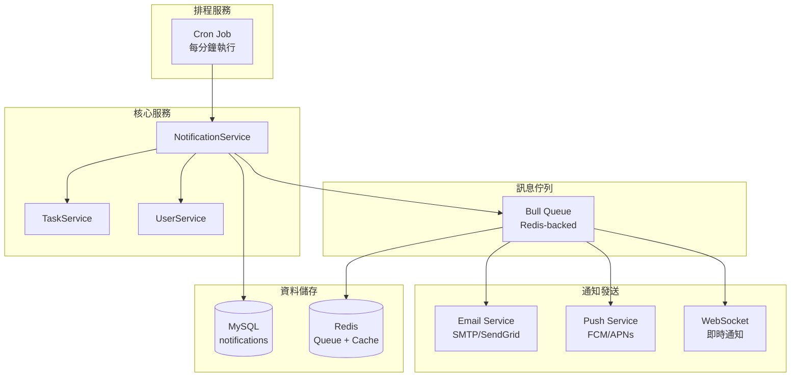
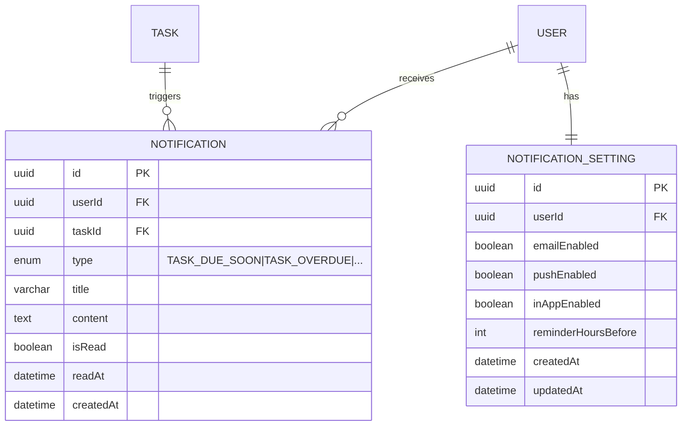
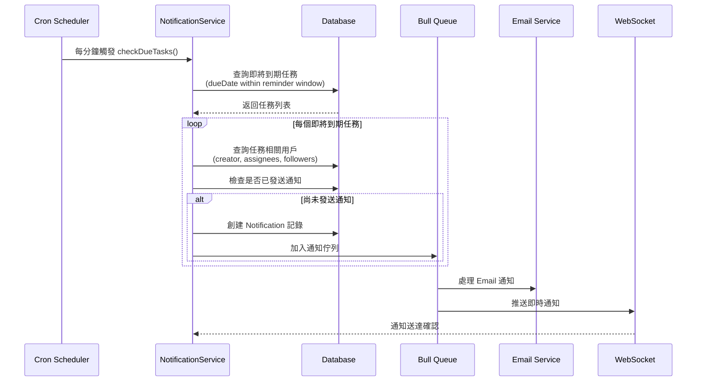
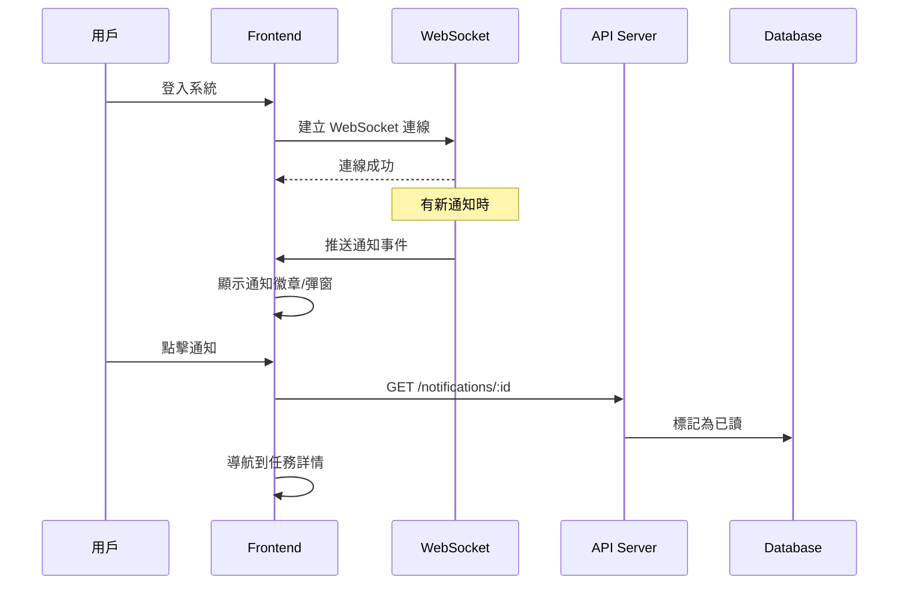
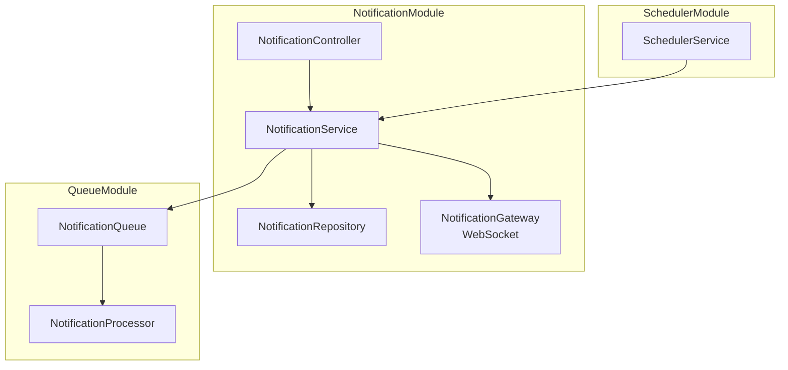
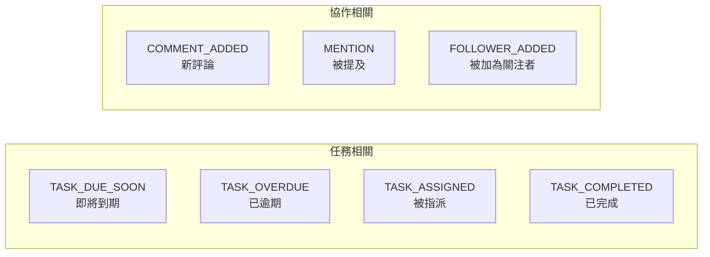
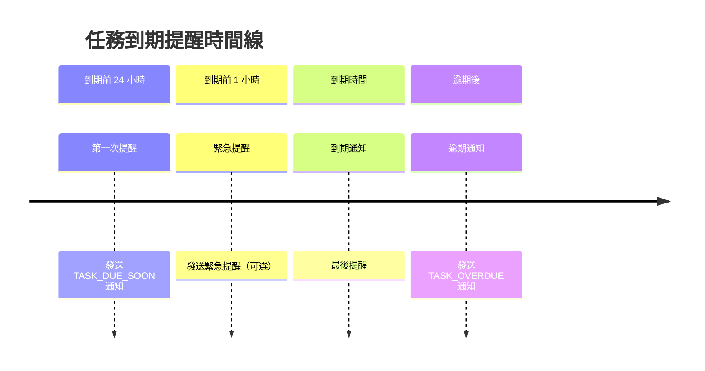

# 任務到期提醒系統設計文件

本文件描述任務即將到期時的訊息提醒功能架構設計。

## 功能概述

當任務的截止日期 (dueDate) 即將到達時，系統會自動發送提醒通知給：
- 任務創建者 (Creator)
- 任務執行人 (Assignees)
- 任務關注者 (Followers)

## 系統架構



## 資料庫 Schema

### Notification 表



### SQL Schema

```sql
-- 通知表
CREATE TABLE notification (
    id CHAR(36) PRIMARY KEY,
    user_id CHAR(36) NOT NULL,
    task_id CHAR(36),
    type ENUM('TASK_DUE_SOON', 'TASK_OVERDUE', 'TASK_ASSIGNED',
              'TASK_COMPLETED', 'COMMENT_ADDED') NOT NULL,
    title VARCHAR(255) NOT NULL,
    content TEXT,
    is_read BOOLEAN DEFAULT FALSE,
    read_at DATETIME,
    created_at DATETIME DEFAULT CURRENT_TIMESTAMP,

    FOREIGN KEY (user_id) REFERENCES user(id) ON DELETE CASCADE,
    FOREIGN KEY (task_id) REFERENCES task(id) ON DELETE SET NULL,
    INDEX idx_user_unread (user_id, is_read),
    INDEX idx_created_at (created_at)
);

-- 通知設定表
CREATE TABLE notification_setting (
    id CHAR(36) PRIMARY KEY,
    user_id CHAR(36) NOT NULL UNIQUE,
    email_enabled BOOLEAN DEFAULT TRUE,
    push_enabled BOOLEAN DEFAULT TRUE,
    in_app_enabled BOOLEAN DEFAULT TRUE,
    reminder_hours_before INT DEFAULT 24,
    created_at DATETIME DEFAULT CURRENT_TIMESTAMP,
    updated_at DATETIME DEFAULT CURRENT_TIMESTAMP ON UPDATE CURRENT_TIMESTAMP,

    FOREIGN KEY (user_id) REFERENCES user(id) ON DELETE CASCADE
);
```

## 處理流程

### 提醒排程流程



### 用戶接收通知流程



## NestJS 實作架構

### Module 結構



### 核心程式碼結構

```typescript
// notification.entity.ts
@Entity()
export class Notification {
  @PrimaryGeneratedColumn('uuid')
  id: string;

  @ManyToOne(() => User)
  user: User;

  @Column()
  userId: string;

  @ManyToOne(() => Task, { nullable: true })
  task: Task;

  @Column({ nullable: true })
  taskId: string;

  @Column({ type: 'enum', enum: NotificationType })
  type: NotificationType;

  @Column()
  title: string;

  @Column({ type: 'text', nullable: true })
  content: string;

  @Column({ default: false })
  isRead: boolean;

  @Column({ nullable: true })
  readAt: Date;

  @CreateDateColumn()
  createdAt: Date;
}

// notification.service.ts
@Injectable()
export class NotificationService {
  constructor(
    private notificationRepo: Repository<Notification>,
    private taskService: TaskService,
    private notificationGateway: NotificationGateway,
    @InjectQueue('notification') private notificationQueue: Queue,
  ) {}

  async checkDueTasks(): Promise<void> {
    const now = new Date();
    const tasks = await this.taskService.findTasksDueSoon(24); // 24小時內到期

    for (const task of tasks) {
      const recipients = this.getTaskRecipients(task);

      for (const userId of recipients) {
        const exists = await this.hasNotificationSent(task.id, userId, 'TASK_DUE_SOON');
        if (!exists) {
          await this.createAndSendNotification(task, userId, 'TASK_DUE_SOON');
        }
      }
    }
  }

  private async createAndSendNotification(
    task: Task,
    userId: string,
    type: NotificationType,
  ): Promise<void> {
    const notification = await this.notificationRepo.save({
      userId,
      taskId: task.id,
      type,
      title: this.getNotificationTitle(type, task),
      content: this.getNotificationContent(type, task),
    });

    // 加入佇列處理
    await this.notificationQueue.add('send', { notificationId: notification.id });

    // WebSocket 即時推送
    this.notificationGateway.sendToUser(userId, notification);
  }
}

// scheduler.service.ts
@Injectable()
export class SchedulerService {
  constructor(private notificationService: NotificationService) {}

  @Cron('* * * * *') // 每分鐘執行
  async handleDueTaskReminders(): Promise<void> {
    await this.notificationService.checkDueTasks();
  }

  @Cron('0 * * * *') // 每小時執行
  async handleOverdueTasks(): Promise<void> {
    await this.notificationService.checkOverdueTasks();
  }
}
```

## API 端點設計

| Method | Endpoint | Description |
|--------|----------|-------------|
| GET | `/api/notifications` | 取得用戶通知列表 |
| GET | `/api/notifications/unread-count` | 取得未讀數量 |
| PATCH | `/api/notifications/:id/read` | 標記單則為已讀 |
| PATCH | `/api/notifications/read-all` | 標記全部為已讀 |
| DELETE | `/api/notifications/:id` | 刪除通知 |
| GET | `/api/notification-settings` | 取得通知設定 |
| PATCH | `/api/notification-settings` | 更新通知設定 |

## 技術選型

| 元件 | 技術選擇 | 說明 |
|------|---------|------|
| 排程 | `@nestjs/schedule` | Cron-based scheduler |
| 佇列 | `@nestjs/bull` + Redis | 可靠的訊息佇列 |
| WebSocket | `@nestjs/websockets` | 即時推送 |
| Email | `@nestjs-modules/mailer` | SMTP/SendGrid |
| Push | `firebase-admin` | FCM for mobile push |

## 通知類型



## 提醒時間策略



## 效能考量

1. **批次處理**: 使用 Bull Queue 批次處理通知，避免阻塞主程序
2. **去重機制**: 檢查是否已發送相同通知，避免重複打擾用戶
3. **索引優化**: 對 `dueDate`、`userId`、`isRead` 建立複合索引
4. **快取策略**: 使用 Redis 快取用戶通知設定
5. **限流保護**: 對 Email/Push 服務設定速率限制

