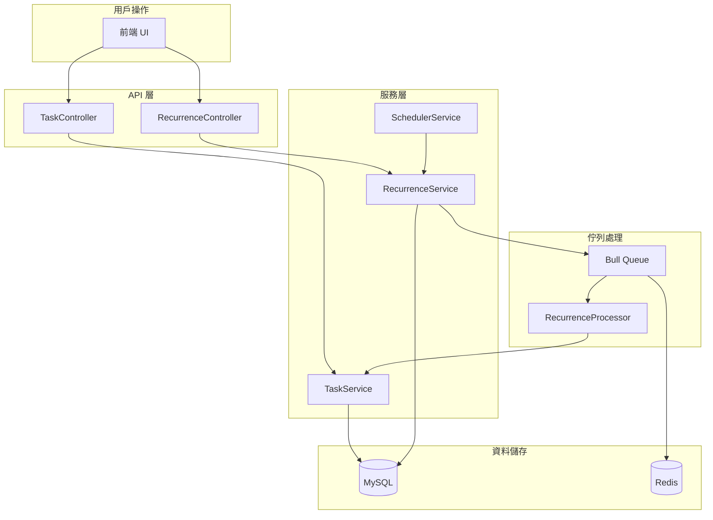
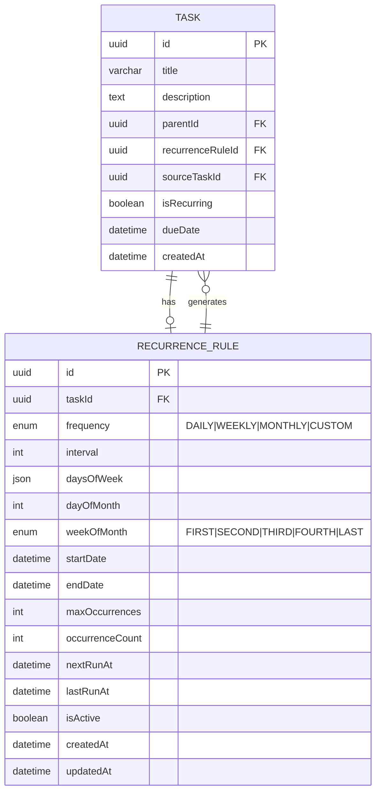
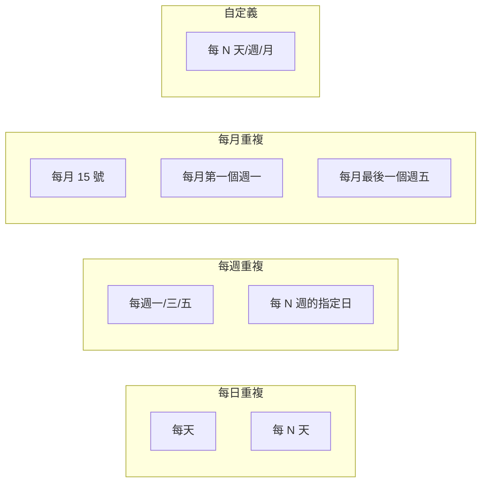
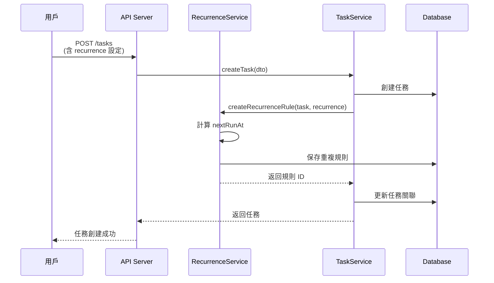
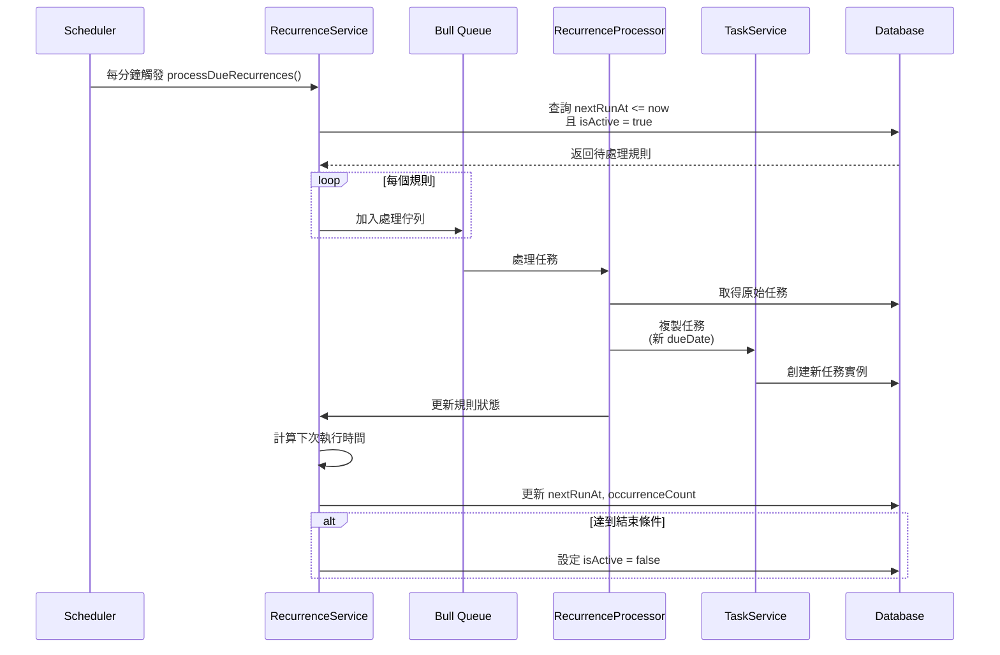
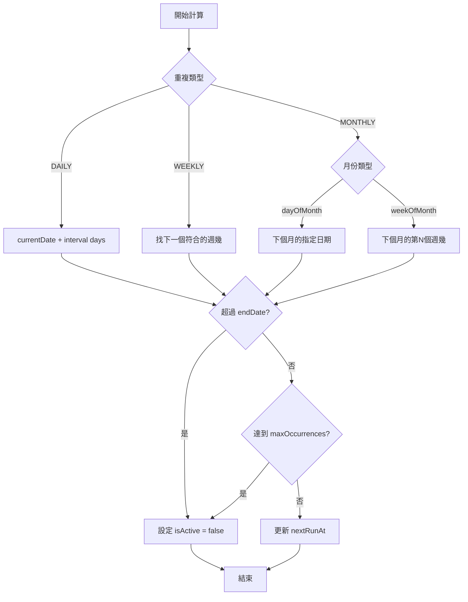
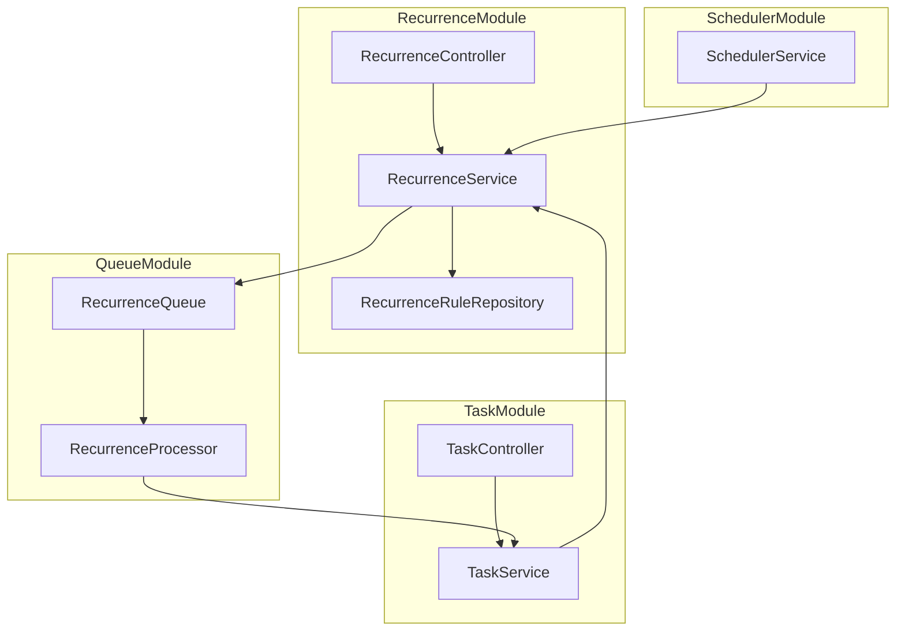
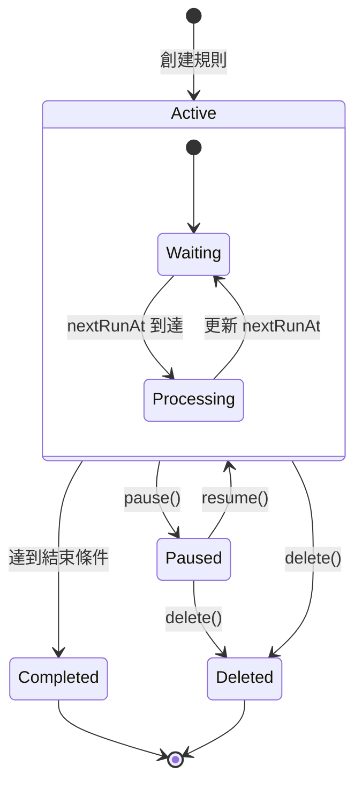
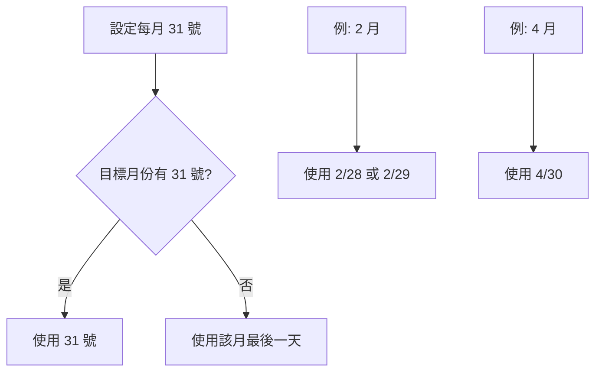

# 定時重複任務系統設計文件

本文件描述定時重複任務功能的架構設計，讓用戶可以設定任務自動重複產生。

## 功能概述

用戶可以為任務設定重複規則，系統會在指定時間自動創建新的任務實例。

支援的重複模式：
- **每日** - 每天固定時間
- **每週** - 指定星期幾
- **每月** - 指定日期或第幾週的星期幾
- **自定義** - 每 N 天/週/月

## 系統架構



## 資料庫 Schema

### Entity Relationship



### SQL Schema

```sql
-- 重複規則表
CREATE TABLE recurrence_rule (
    id CHAR(36) PRIMARY KEY,
    task_id CHAR(36) NOT NULL,

    -- 重複頻率
    frequency ENUM('DAILY', 'WEEKLY', 'MONTHLY', 'CUSTOM') NOT NULL,
    `interval` INT DEFAULT 1,  -- 每隔幾個單位

    -- 週重複設定 (WEEKLY)
    days_of_week JSON,  -- [0,1,2,3,4,5,6] 代表週日到週六

    -- 月重複設定 (MONTHLY)
    day_of_month INT,  -- 每月幾號 (1-31)
    week_of_month ENUM('FIRST', 'SECOND', 'THIRD', 'FOURTH', 'LAST'),

    -- 時間範圍
    start_date DATETIME NOT NULL,
    end_date DATETIME,  -- NULL 表示永不結束

    -- 次數限制
    max_occurrences INT,  -- NULL 表示無限次
    occurrence_count INT DEFAULT 0,

    -- 執行追蹤
    next_run_at DATETIME NOT NULL,
    last_run_at DATETIME,
    is_active BOOLEAN DEFAULT TRUE,

    created_at DATETIME DEFAULT CURRENT_TIMESTAMP,
    updated_at DATETIME DEFAULT CURRENT_TIMESTAMP ON UPDATE CURRENT_TIMESTAMP,

    FOREIGN KEY (task_id) REFERENCES task(id) ON DELETE CASCADE,
    INDEX idx_next_run (next_run_at, is_active),
    INDEX idx_task (task_id)
);

-- 在 task 表新增欄位
ALTER TABLE task ADD COLUMN recurrence_rule_id CHAR(36);
ALTER TABLE task ADD COLUMN source_task_id CHAR(36);
ALTER TABLE task ADD COLUMN is_recurring BOOLEAN DEFAULT FALSE;
ALTER TABLE task ADD FOREIGN KEY (recurrence_rule_id) REFERENCES recurrence_rule(id) ON DELETE SET NULL;
ALTER TABLE task ADD FOREIGN KEY (source_task_id) REFERENCES task(id) ON DELETE SET NULL;
```

## 重複模式詳解

### 支援的重複模式



### 重複規則範例

```json
// 每天重複
{
  "frequency": "DAILY",
  "interval": 1,
  "startDate": "2026-01-01T09:00:00Z"
}

// 每週一三五
{
  "frequency": "WEEKLY",
  "interval": 1,
  "daysOfWeek": [1, 3, 5],
  "startDate": "2026-01-01T09:00:00Z"
}

// 每月 15 號
{
  "frequency": "MONTHLY",
  "interval": 1,
  "dayOfMonth": 15,
  "startDate": "2026-01-01T09:00:00Z"
}

// 每月最後一個週五
{
  "frequency": "MONTHLY",
  "interval": 1,
  "daysOfWeek": [5],
  "weekOfMonth": "LAST",
  "startDate": "2026-01-01T09:00:00Z"
}

// 每兩週
{
  "frequency": "WEEKLY",
  "interval": 2,
  "daysOfWeek": [1],
  "startDate": "2026-01-01T09:00:00Z"
}
```

## 處理流程

### 創建重複任務流程



### 自動產生任務流程



### 下次執行時間計算



## NestJS 實作架構

### Module 結構



### 核心程式碼結構

```typescript
// recurrence-rule.entity.ts
@Entity()
export class RecurrenceRule {
  @PrimaryGeneratedColumn('uuid')
  id: string;

  @OneToOne(() => Task)
  @JoinColumn()
  task: Task;

  @Column()
  taskId: string;

  @Column({ type: 'enum', enum: RecurrenceFrequency })
  frequency: RecurrenceFrequency;

  @Column({ default: 1 })
  interval: number;

  @Column({ type: 'json', nullable: true })
  daysOfWeek: number[];

  @Column({ nullable: true })
  dayOfMonth: number;

  @Column({ type: 'enum', enum: WeekOfMonth, nullable: true })
  weekOfMonth: WeekOfMonth;

  @Column()
  startDate: Date;

  @Column({ nullable: true })
  endDate: Date;

  @Column({ nullable: true })
  maxOccurrences: number;

  @Column({ default: 0 })
  occurrenceCount: number;

  @Column()
  nextRunAt: Date;

  @Column({ nullable: true })
  lastRunAt: Date;

  @Column({ default: true })
  isActive: boolean;

  @CreateDateColumn()
  createdAt: Date;

  @UpdateDateColumn()
  updatedAt: Date;
}

// recurrence.service.ts
@Injectable()
export class RecurrenceService {
  constructor(
    private recurrenceRepo: Repository<RecurrenceRule>,
    private taskService: TaskService,
    @InjectQueue('recurrence') private recurrenceQueue: Queue,
  ) {}

  async createRecurrenceRule(
    task: Task,
    dto: CreateRecurrenceDto,
  ): Promise<RecurrenceRule> {
    const nextRunAt = this.calculateNextRun(dto);

    return this.recurrenceRepo.save({
      taskId: task.id,
      ...dto,
      nextRunAt,
    });
  }

  async processDueRecurrences(): Promise<void> {
    const now = new Date();
    const rules = await this.recurrenceRepo.find({
      where: {
        isActive: true,
        nextRunAt: LessThanOrEqual(now),
      },
      relations: ['task'],
    });

    for (const rule of rules) {
      await this.recurrenceQueue.add('generate', { ruleId: rule.id });
    }
  }

  calculateNextRun(rule: RecurrenceRule | CreateRecurrenceDto): Date {
    const baseDate = rule.lastRunAt || rule.startDate;
    let nextDate: Date;

    switch (rule.frequency) {
      case RecurrenceFrequency.DAILY:
        nextDate = addDays(baseDate, rule.interval);
        break;

      case RecurrenceFrequency.WEEKLY:
        nextDate = this.calculateNextWeekly(baseDate, rule);
        break;

      case RecurrenceFrequency.MONTHLY:
        nextDate = this.calculateNextMonthly(baseDate, rule);
        break;

      default:
        nextDate = addDays(baseDate, rule.interval);
    }

    return nextDate;
  }

  private calculateNextWeekly(base: Date, rule: RecurrenceRule): Date {
    const daysOfWeek = rule.daysOfWeek || [getDay(base)];
    let current = addDays(base, 1);

    while (true) {
      if (daysOfWeek.includes(getDay(current))) {
        return current;
      }
      current = addDays(current, 1);

      // 跳過 interval 週
      if (getDay(current) === daysOfWeek[0]) {
        current = addWeeks(current, rule.interval - 1);
      }
    }
  }

  private calculateNextMonthly(base: Date, rule: RecurrenceRule): Date {
    if (rule.dayOfMonth) {
      return setDate(addMonths(base, rule.interval), rule.dayOfMonth);
    }

    if (rule.weekOfMonth && rule.daysOfWeek?.length) {
      return this.getNthWeekdayOfMonth(
        addMonths(base, rule.interval),
        rule.weekOfMonth,
        rule.daysOfWeek[0],
      );
    }

    return addMonths(base, rule.interval);
  }
}

// recurrence.processor.ts
@Processor('recurrence')
export class RecurrenceProcessor {
  constructor(
    private recurrenceService: RecurrenceService,
    private taskService: TaskService,
  ) {}

  @Process('generate')
  async handleGenerate(job: Job<{ ruleId: string }>): Promise<void> {
    const rule = await this.recurrenceService.findById(job.data.ruleId);
    if (!rule || !rule.isActive) return;

    // 複製原始任務
    const sourceTask = rule.task;
    const newDueDate = this.calculateNewDueDate(sourceTask, rule);

    await this.taskService.create({
      ...sourceTask,
      id: undefined,
      sourceTaskId: sourceTask.id,
      dueDate: newDueDate,
      status: TaskStatus.PENDING,
      isCompleted: false,
    });

    // 更新規則
    await this.recurrenceService.updateAfterGeneration(rule);
  }
}

// scheduler.service.ts
@Injectable()
export class SchedulerService {
  constructor(private recurrenceService: RecurrenceService) {}

  @Cron('* * * * *') // 每分鐘
  async handleRecurrences(): Promise<void> {
    await this.recurrenceService.processDueRecurrences();
  }
}
```

## API 端點設計

| Method | Endpoint | Description |
|--------|----------|-------------|
| POST | `/api/tasks` | 創建任務（含 recurrence） |
| GET | `/api/tasks/:id/recurrence` | 取得任務重複規則 |
| PATCH | `/api/tasks/:id/recurrence` | 更新重複規則 |
| DELETE | `/api/tasks/:id/recurrence` | 刪除重複規則 |
| POST | `/api/tasks/:id/recurrence/skip` | 跳過下一次 |
| POST | `/api/tasks/:id/recurrence/pause` | 暫停重複 |
| POST | `/api/tasks/:id/recurrence/resume` | 恢復重複 |

### 創建重複任務 Request

```json
POST /api/tasks
{
  "title": "Weekly Team Meeting",
  "description": "Sprint planning meeting",
  "dueDate": "2026-01-06T10:00:00Z",
  "recurrence": {
    "frequency": "WEEKLY",
    "interval": 1,
    "daysOfWeek": [1],
    "startDate": "2026-01-06T10:00:00Z",
    "endDate": "2026-12-31T10:00:00Z"
  }
}
```

## 狀態機



## 邊界情況處理

### 月份日期不存在



### 任務編輯影響

| 操作 | 對重複規則的影響 |
|------|------------------|
| 編輯原始任務 | 更新模板，影響未來生成 |
| 編輯生成的任務 | 只影響該任務，不影響規則 |
| 刪除原始任務 | 刪除規則，不影響已生成任務 |
| 刪除生成的任務 | 不影響規則 |

## 技術選型

| 元件 | 技術選擇 | 說明 |
|------|---------|------|
| 排程 | `@nestjs/schedule` | Cron 定時任務 |
| 佇列 | `@nestjs/bull` + Redis | 可靠任務處理 |
| 日期處理 | `date-fns` | 日期計算庫 |
| 規則解析 | `rrule` (可選) | iCal RRULE 標準 |

## 效能考量

1. **索引優化**: `(next_run_at, is_active)` 複合索引
2. **批次處理**: 使用 Bull Queue 避免阻塞
3. **限制查詢**: 每次只處理當前時間點的規則
4. **快取策略**: 快取規則的下次執行時間計算結果
5. **歷史清理**: 定期清理已結束的規則
