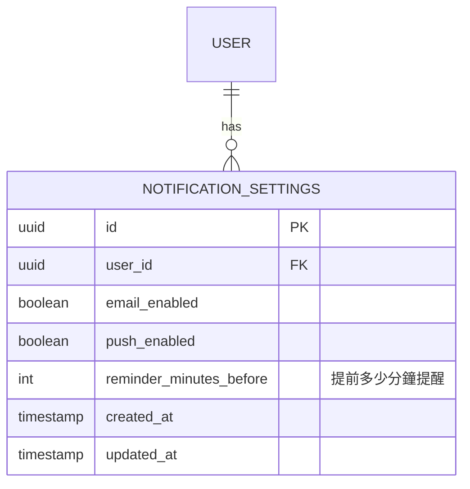
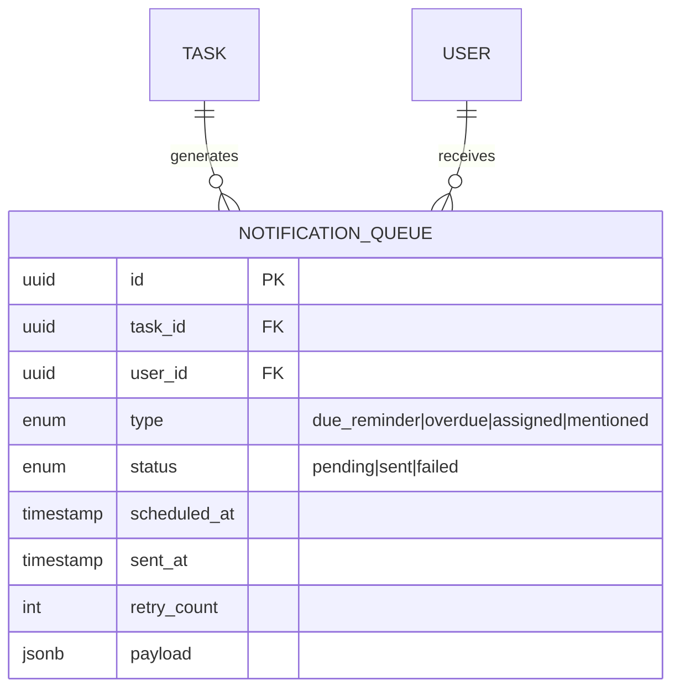
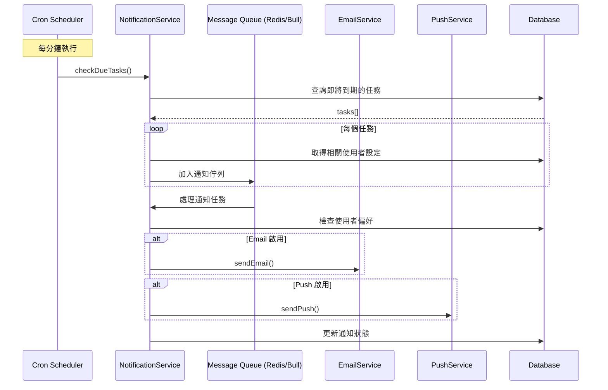

# 任務到期提醒功能規劃

> 此文件為 Schema 架構與流程規劃，依題目要求以文字敘述方式呈現

## 1. 功能概述

實現訊息提醒功能，在任務即將到期時通知相關使用者（執行人、關注者）。

### 支援的提醒類型
- **due_reminder**: 任務即將到期提醒
- **overdue**: 任務已過期提醒
- **assigned**: 被指派為執行人通知
- **mentioned**: 在評論中被提及通知

### 支援的通知管道
- Email 通知
- Push 推播通知（Web/Mobile）

---

## 2. Schema 設計

### 2.1 通知設定表 (NOTIFICATION_SETTINGS)

儲存每個使用者的通知偏好設定。



| 欄位 | 類型 | 說明 |
|------|------|------|
| id | UUID | 主鍵 |
| user_id | UUID | 關聯使用者 |
| email_enabled | Boolean | 是否啟用 Email 通知 |
| push_enabled | Boolean | 是否啟用 Push 通知 |
| reminder_minutes_before | Integer | 提前多少分鐘提醒（預設 30） |
| created_at | Timestamp | 建立時間 |
| updated_at | Timestamp | 更新時間 |

### 2.2 通知佇列表 (NOTIFICATION_QUEUE)

管理待發送及已發送的通知記錄。



| 欄位 | 類型 | 說明 |
|------|------|------|
| id | UUID | 主鍵 |
| task_id | UUID | 關聯任務 |
| user_id | UUID | 接收通知的使用者 |
| type | Enum | 通知類型 |
| status | Enum | 發送狀態 (pending/sent/failed) |
| scheduled_at | Timestamp | 預定發送時間 |
| sent_at | Timestamp | 實際發送時間 |
| retry_count | Integer | 重試次數 |
| payload | JSONB | 通知內容（標題、內容、連結等） |

---

## 3. 流程設計

### 3.1 通知排程與發送流程



### 3.2 流程說明

1. **排程檢查** (每分鐘執行)
   - Cron Job 觸發 `checkDueTasks()`
   - 查詢 `due_date` 在使用者設定的提醒時間範圍內的任務

2. **通知入隊**
   - 為每個任務的執行人和關注者建立通知記錄
   - 將通知加入 Redis Bull Queue

3. **通知發送**
   - Queue Worker 處理通知任務
   - 根據使用者偏好選擇發送管道
   - 發送失敗時自動重試（最多 3 次）

4. **狀態更新**
   - 更新 `NOTIFICATION_QUEUE` 的狀態和發送時間

---

## 4. 技術選型

| 元件 | 技術/服務 | 用途 |
|------|----------|------|
| 排程器 | @nestjs/schedule | Cron Job 管理 |
| 訊息佇列 | Bull Queue (Redis) | 通知任務排程與處理 |
| Email 服務 | Nodemailer / SendGrid | Email 發送 |
| Push 服務 | Firebase Cloud Messaging (FCM) | Web/Mobile 推播 |

---

## 5. API 端點規劃

### 5.1 通知設定

```
GET    /api/notifications/settings          # 取得通知設定
PUT    /api/notifications/settings          # 更新通知設定
```

### 5.2 通知列表

```
GET    /api/notifications                   # 取得通知列表
PATCH  /api/notifications/:id/read          # 標記為已讀
POST   /api/notifications/read-all          # 全部標記為已讀
```

---

## 6. 注意事項

1. **避免重複通知**: 使用 `scheduled_at` + `task_id` + `user_id` 作為唯一索引
2. **時區處理**: 提醒時間需考慮使用者所在時區
3. **批次處理**: 大量通知時使用批次發送以提升效能
4. **退訂機制**: 提供使用者關閉特定類型通知的選項
