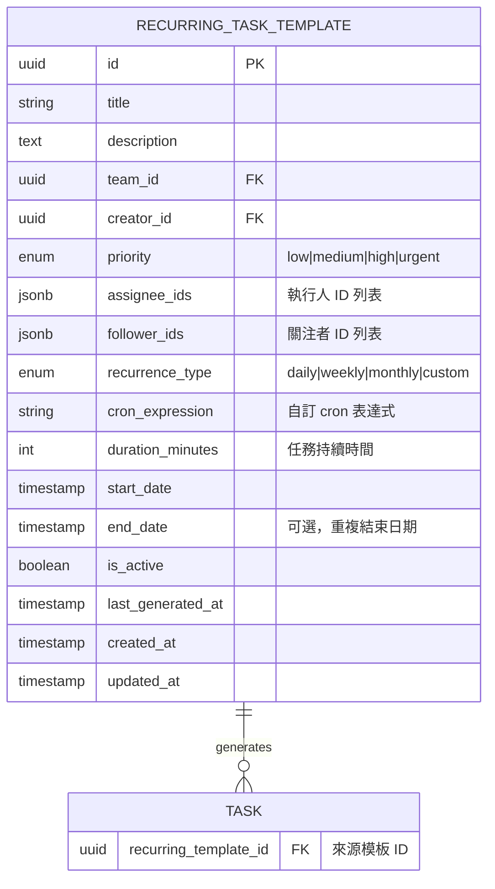
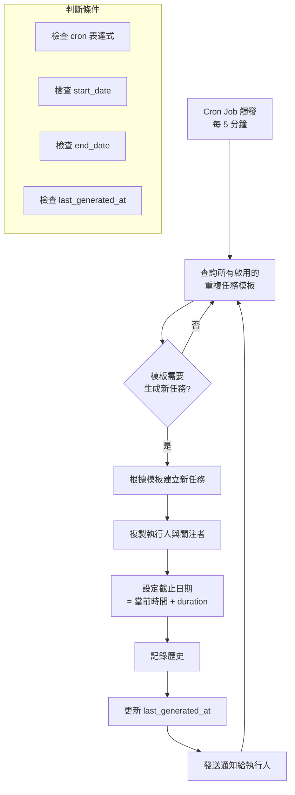

# 定時重複任務功能規劃

> 此文件為 Schema 架構與流程規劃，依題目要求以文字敘述方式呈現

## 1. 功能概述

允許使用者建立定時重複的任務模板，系統會根據設定的週期自動產生新任務。

### 支援的重複類型
- **daily**: 每日重複
- **weekly**: 每週重複
- **monthly**: 每月重複
- **custom**: 自訂 cron 表達式

### 使用情境
- 每日站立會議準備
- 每週報告提交
- 每月帳單處理
- 定期系統維護檢查

---

## 2. Schema 設計

### 2.1 重複任務模板表 (RECURRING_TASK_TEMPLATE)

儲存重複任務的模板設定。



| 欄位 | 類型 | 說明 |
|------|------|------|
| id | UUID | 主鍵 |
| title | String | 任務標題模板 |
| description | Text | 任務描述模板 |
| team_id | UUID | 所屬團隊 |
| creator_id | UUID | 建立者 |
| priority | Enum | 優先級 (low/medium/high/urgent) |
| assignee_ids | JSONB | 執行人 ID 陣列 |
| follower_ids | JSONB | 關注者 ID 陣列 |
| recurrence_type | Enum | 重複類型 |
| cron_expression | String | Cron 表達式 |
| duration_minutes | Integer | 任務持續時間（分鐘） |
| start_date | Timestamp | 開始生效日期 |
| end_date | Timestamp | 結束日期（可選） |
| is_active | Boolean | 是否啟用 |
| last_generated_at | Timestamp | 上次生成任務時間 |
| created_at | Timestamp | 建立時間 |
| updated_at | Timestamp | 更新時間 |

### 2.2 任務表擴展

在現有 `TASK` 表新增欄位：

| 欄位 | 類型 | 說明 |
|------|------|------|
| recurring_template_id | UUID (nullable) | 來源重複任務模板 ID |

---

## 3. Recurrence Type 說明

| Type | Cron Expression 範例 | 說明 |
|------|---------------------|------|
| daily | `0 9 * * *` | 每天早上 9 點 |
| weekly | `0 9 * * 1` | 每週一早上 9 點 |
| monthly | `0 9 1 * *` | 每月 1 號早上 9 點 |
| custom | 自訂 | 使用者自訂 cron 表達式 |

### Cron 表達式格式

```
┌───────────── 分鐘 (0 - 59)
│ ┌───────────── 小時 (0 - 23)
│ │ ┌───────────── 日 (1 - 31)
│ │ │ ┌───────────── 月 (1 - 12)
│ │ │ │ ┌───────────── 星期 (0 - 6) (週日 = 0)
│ │ │ │ │
* * * * *
```

---

## 4. 流程設計

### 4.1 任務生成流程



### 4.2 判斷是否需要生成新任務

```typescript
function shouldGenerateTask(template: RecurringTaskTemplate): boolean {
  const now = new Date();

  // 1. 檢查是否啟用
  if (!template.is_active) return false;

  // 2. 檢查開始日期
  if (template.start_date > now) return false;

  // 3. 檢查結束日期
  if (template.end_date && template.end_date < now) return false;

  // 4. 解析 cron 表達式，取得下一個執行時間
  const interval = cronParser.parseExpression(template.cron_expression);
  const nextRun = interval.next().toDate();

  // 5. 檢查是否已經生成過
  if (template.last_generated_at) {
    const lastRun = new Date(template.last_generated_at);
    // 如果上次生成時間在下一個執行時間之後，則不需要生成
    if (lastRun >= nextRun) return false;
  }

  // 6. 檢查當前時間是否已到達執行時間
  return now >= nextRun;
}
```

### 4.3 流程說明

1. **排程檢查** (每 5 分鐘執行)
   - Cron Job 觸發任務生成檢查
   - 查詢所有 `is_active = true` 的模板

2. **判斷生成條件**
   - 解析 cron 表達式計算下次執行時間
   - 比對 `last_generated_at` 避免重複生成
   - 檢查 `start_date` 和 `end_date` 範圍

3. **建立新任務**
   - 從模板複製任務資訊
   - 設定 `due_date = now + duration_minutes`
   - 複製執行人和關注者
   - 設定 `recurring_template_id` 關聯

4. **後續處理**
   - 記錄任務歷史
   - 更新模板的 `last_generated_at`
   - 發送通知給執行人

---

## 5. 技術選型

| 元件 | 技術/服務 | 用途 |
|------|----------|------|
| 排程器 | @nestjs/schedule + cron | 定時任務排程 |
| Cron 解析 | cron-parser | 解析 cron 表達式 |
| 任務佇列 | Bull Queue (Redis) | 任務生成佇列（避免重複） |
| 鎖機制 | Redis Lock | 分散式鎖（多實例部署時） |

---

## 6. API 端點規劃

### 6.1 重複任務模板 CRUD

```
GET    /api/recurring-templates              # 取得模板列表
POST   /api/recurring-templates              # 建立模板
GET    /api/recurring-templates/:id          # 取得模板詳情
PATCH  /api/recurring-templates/:id          # 更新模板
DELETE /api/recurring-templates/:id          # 刪除模板
```

### 6.2 模板控制

```
POST   /api/recurring-templates/:id/activate    # 啟用模板
POST   /api/recurring-templates/:id/deactivate  # 停用模板
POST   /api/recurring-templates/:id/trigger     # 手動觸發生成
```

### 6.3 Request/Response 範例

**建立模板 Request:**
```json
{
  "title": "每週週報",
  "description": "撰寫並提交本週工作週報",
  "teamId": "uuid",
  "priority": "medium",
  "assigneeIds": ["uuid1", "uuid2"],
  "followerIds": ["uuid3"],
  "recurrenceType": "weekly",
  "cronExpression": "0 9 * * 1",
  "durationMinutes": 480,
  "startDate": "2026-01-01T00:00:00Z",
  "endDate": "2026-12-31T23:59:59Z"
}
```

**模板 Response:**
```json
{
  "id": "uuid",
  "title": "每週週報",
  "description": "撰寫並提交本週工作週報",
  "recurrenceType": "weekly",
  "cronExpression": "0 9 * * 1",
  "nextRunAt": "2026-01-13T09:00:00Z",
  "isActive": true,
  "lastGeneratedAt": "2026-01-06T09:00:00Z",
  "createdAt": "2026-01-01T00:00:00Z"
}
```

---

## 7. 注意事項

1. **避免重複生成**: 使用 Redis 分散式鎖確保多實例部署時不會重複生成
2. **時區處理**: Cron 表達式應基於 UTC，顯示時轉換為使用者時區
3. **模板刪除**: 軟刪除模板，已生成的任務保留
4. **錯誤處理**: 生成失敗時記錄錯誤，下次排程重試
5. **效能考量**: 大量模板時使用批次查詢和處理
