# TodoList Backend Specification

> 後端技術棧：NestJS + TypeScript + PostgreSQL + TypeORM

## 1. 系統架構概覽

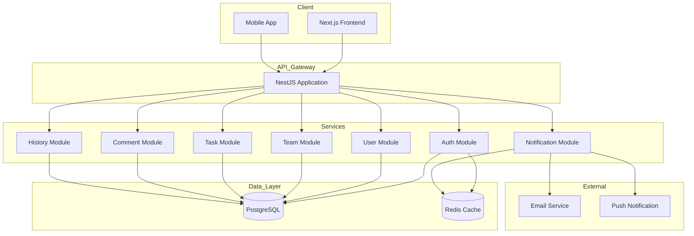

---

## 2. 資料庫設計 (Database Schema)

### 2.1 Entity Relationship Diagram

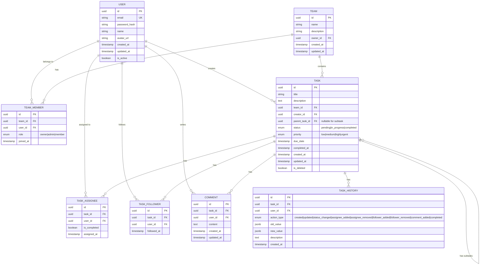

### 2.2 資料表詳細說明

#### 2.2.1 users 表

| 欄位 | 類型 | 約束 | 說明 |
|------|------|------|------|
| id | UUID | PK | 主鍵 |
| email | VARCHAR(255) | UNIQUE, NOT NULL | 電子郵件 |
| password_hash | VARCHAR(255) | NOT NULL | 密碼雜湊 |
| name | VARCHAR(100) | NOT NULL | 顯示名稱 |
| avatar_url | VARCHAR(500) | NULLABLE | 頭像 URL |
| created_at | TIMESTAMP | DEFAULT NOW() | 建立時間 |
| updated_at | TIMESTAMP | DEFAULT NOW() | 更新時間 |
| is_active | BOOLEAN | DEFAULT TRUE | 帳號狀態 |

#### 2.2.2 teams 表

| 欄位 | 類型 | 約束 | 說明 |
|------|------|------|------|
| id | UUID | PK | 主鍵 |
| name | VARCHAR(100) | NOT NULL | 團隊名稱 |
| description | TEXT | NULLABLE | 團隊描述 |
| owner_id | UUID | FK -> users.id | 擁有者 |
| created_at | TIMESTAMP | DEFAULT NOW() | 建立時間 |
| updated_at | TIMESTAMP | DEFAULT NOW() | 更新時間 |

#### 2.2.3 team_members 表

| 欄位 | 類型 | 約束 | 說明 |
|------|------|------|------|
| id | UUID | PK | 主鍵 |
| team_id | UUID | FK -> teams.id | 團隊 ID |
| user_id | UUID | FK -> users.id | 使用者 ID |
| role | ENUM | 'owner', 'admin', 'member' | 角色 |
| joined_at | TIMESTAMP | DEFAULT NOW() | 加入時間 |

**UNIQUE 約束**: (team_id, user_id)

#### 2.2.4 tasks 表

| 欄位 | 類型 | 約束 | 說明 |
|------|------|------|------|
| id | UUID | PK | 主鍵 |
| title | VARCHAR(255) | NOT NULL | 任務標題 |
| description | TEXT | NULLABLE | 任務描述 |
| team_id | UUID | FK -> teams.id | 所屬團隊 |
| creator_id | UUID | FK -> users.id | 建立者 |
| parent_task_id | UUID | FK -> tasks.id, NULLABLE | 父任務 (子任務用) |
| status | ENUM | 'pending', 'in_progress', 'completed' | 狀態 |
| priority | ENUM | 'low', 'medium', 'high', 'urgent' | 優先級 |
| due_date | TIMESTAMP | NULLABLE | 截止日期 |
| completed_at | TIMESTAMP | NULLABLE | 完成時間 |
| created_at | TIMESTAMP | DEFAULT NOW() | 建立時間 |
| updated_at | TIMESTAMP | DEFAULT NOW() | 更新時間 |
| is_deleted | BOOLEAN | DEFAULT FALSE | 軟刪除標記 |

**索引建議**:
- `idx_tasks_team_id` ON (team_id)
- `idx_tasks_creator_id` ON (creator_id)
- `idx_tasks_parent_task_id` ON (parent_task_id)
- `idx_tasks_status` ON (status)
- `idx_tasks_due_date` ON (due_date)

#### 2.2.5 task_assignees 表

| 欄位 | 類型 | 約束 | 說明 |
|------|------|------|------|
| id | UUID | PK | 主鍵 |
| task_id | UUID | FK -> tasks.id | 任務 ID |
| user_id | UUID | FK -> users.id | 執行人 ID |
| is_completed | BOOLEAN | DEFAULT FALSE | 個人完成狀態 |
| assigned_at | TIMESTAMP | DEFAULT NOW() | 指派時間 |

**UNIQUE 約束**: (task_id, user_id)

#### 2.2.6 task_followers 表

| 欄位 | 類型 | 約束 | 說明 |
|------|------|------|------|
| id | UUID | PK | 主鍵 |
| task_id | UUID | FK -> tasks.id | 任務 ID |
| user_id | UUID | FK -> users.id | 關注者 ID |
| followed_at | TIMESTAMP | DEFAULT NOW() | 關注時間 |

**UNIQUE 約束**: (task_id, user_id)

#### 2.2.7 comments 表

| 欄位 | 類型 | 約束 | 說明 |
|------|------|------|------|
| id | UUID | PK | 主鍵 |
| task_id | UUID | FK -> tasks.id | 任務 ID |
| user_id | UUID | FK -> users.id | 評論者 ID |
| content | TEXT | NOT NULL | 評論內容 |
| created_at | TIMESTAMP | DEFAULT NOW() | 建立時間 |
| updated_at | TIMESTAMP | DEFAULT NOW() | 更新時間 |

#### 2.2.8 task_histories 表

| 欄位 | 類型 | 約束 | 說明 |
|------|------|------|------|
| id | UUID | PK | 主鍵 |
| task_id | UUID | FK -> tasks.id | 任務 ID |
| user_id | UUID | FK -> users.id | 操作者 ID |
| action_type | ENUM | 見下方 | 操作類型 |
| old_value | JSONB | NULLABLE | 變更前的值 |
| new_value | JSONB | NULLABLE | 變更後的值 |
| description | TEXT | NOT NULL | 操作描述 |
| created_at | TIMESTAMP | DEFAULT NOW() | 操作時間 |

**action_type 枚舉值**:
- `created` - 任務建立
- `updated` - 任務更新
- `status_changed` - 狀態變更
- `assignee_added` - 新增執行人
- `assignee_removed` - 移除執行人
- `follower_added` - 新增關注者
- `follower_removed` - 移除關注者
- `comment_added` - 新增評論
- `completed` - 任務完成

---

## 3. NestJS 模組架構

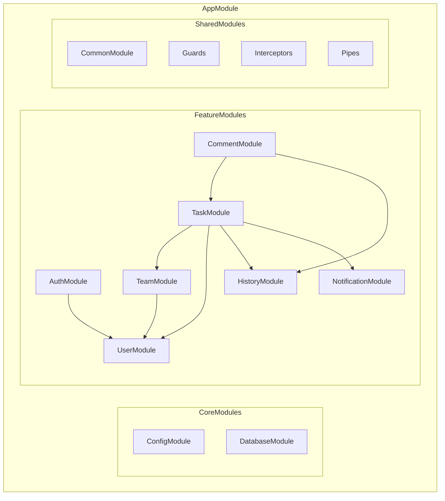

### 3.1 模組職責說明

| 模組 | 職責 |
|------|------|
| **AuthModule** | JWT 認證、登入/註冊、Token 刷新 |
| **UserModule** | 使用者 CRUD、個人資料管理 |
| **TeamModule** | 團隊管理、成員管理、邀請功能 |
| **TaskModule** | 任務 CRUD、子任務、指派人/關注者管理 |
| **CommentModule** | 評論 CRUD |
| **HistoryModule** | 任務歷史紀錄查詢 |
| **NotificationModule** | 通知發送、訂閱管理 |

### 3.2 專案目錄結構

```
src/
├── app.module.ts
├── main.ts
├── common/
│   ├── decorators/
│   │   ├── current-user.decorator.ts
│   │   └── roles.decorator.ts
│   ├── guards/
│   │   ├── jwt-auth.guard.ts
│   │   └── roles.guard.ts
│   ├── interceptors/
│   │   └── transform.interceptor.ts
│   ├── pipes/
│   │   └── validation.pipe.ts
│   ├── filters/
│   │   └── http-exception.filter.ts
│   └── dto/
│       └── pagination.dto.ts
├── config/
│   ├── database.config.ts
│   ├── jwt.config.ts
│   └── app.config.ts
├── modules/
│   ├── auth/
│   │   ├── auth.module.ts
│   │   ├── auth.controller.ts
│   │   ├── auth.service.ts
│   │   ├── strategies/
│   │   │   └── jwt.strategy.ts
│   │   └── dto/
│   │       ├── login.dto.ts
│   │       └── register.dto.ts
│   ├── user/
│   │   ├── user.module.ts
│   │   ├── user.controller.ts
│   │   ├── user.service.ts
│   │   ├── entities/
│   │   │   └── user.entity.ts
│   │   └── dto/
│   │       └── update-user.dto.ts
│   ├── team/
│   │   ├── team.module.ts
│   │   ├── team.controller.ts
│   │   ├── team.service.ts
│   │   ├── entities/
│   │   │   ├── team.entity.ts
│   │   │   └── team-member.entity.ts
│   │   └── dto/
│   │       ├── create-team.dto.ts
│   │       └── add-member.dto.ts
│   ├── task/
│   │   ├── task.module.ts
│   │   ├── task.controller.ts
│   │   ├── task.service.ts
│   │   ├── entities/
│   │   │   ├── task.entity.ts
│   │   │   ├── task-assignee.entity.ts
│   │   │   └── task-follower.entity.ts
│   │   └── dto/
│   │       ├── create-task.dto.ts
│   │       ├── update-task.dto.ts
│   │       └── task-filter.dto.ts
│   ├── comment/
│   │   ├── comment.module.ts
│   │   ├── comment.controller.ts
│   │   ├── comment.service.ts
│   │   ├── entities/
│   │   │   └── comment.entity.ts
│   │   └── dto/
│   │       └── create-comment.dto.ts
│   ├── history/
│   │   ├── history.module.ts
│   │   ├── history.controller.ts
│   │   ├── history.service.ts
│   │   └── entities/
│   │       └── task-history.entity.ts
│   └── notification/
│       ├── notification.module.ts
│       ├── notification.service.ts
│       └── notification.gateway.ts
└── database/
    ├── migrations/
    └── seeds/
```

---

## 4. 商業邏輯

### 4.1 認證流程

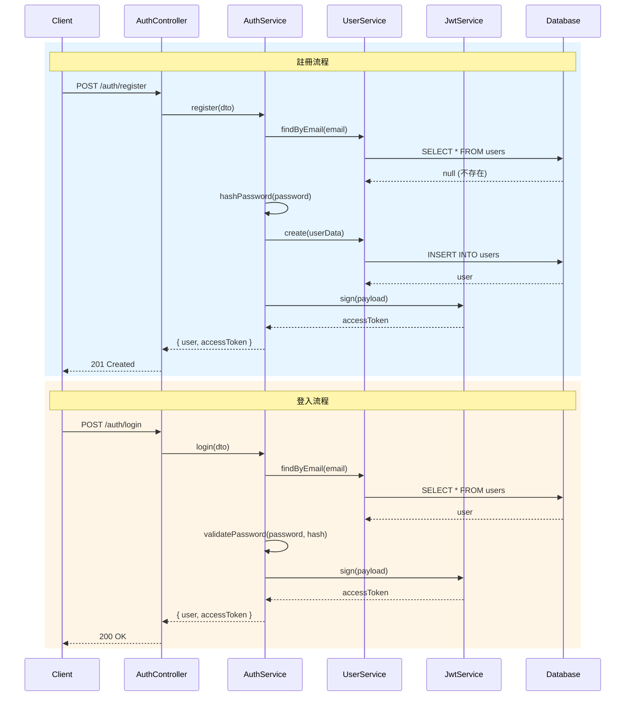

### 4.2 任務建立流程

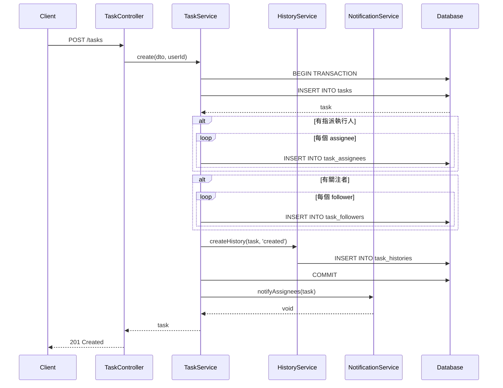

### 4.3 子任務完成邏輯

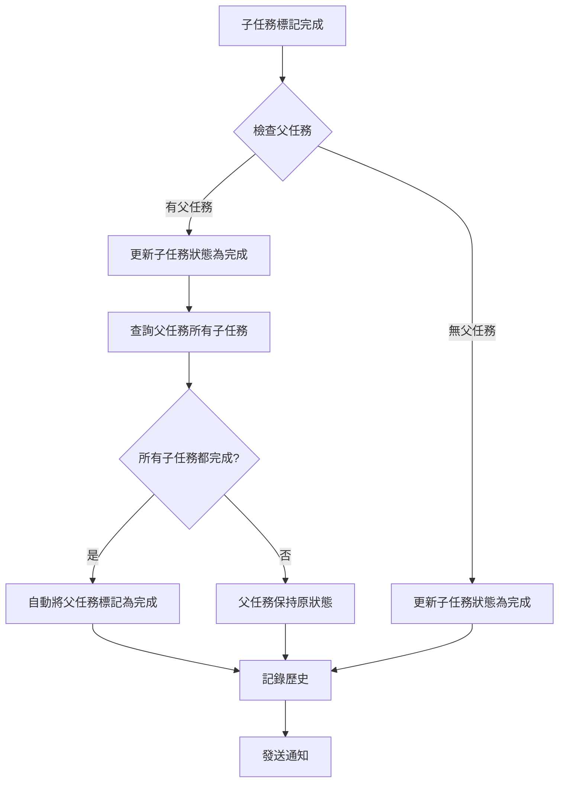

### 4.4 任務完成規則

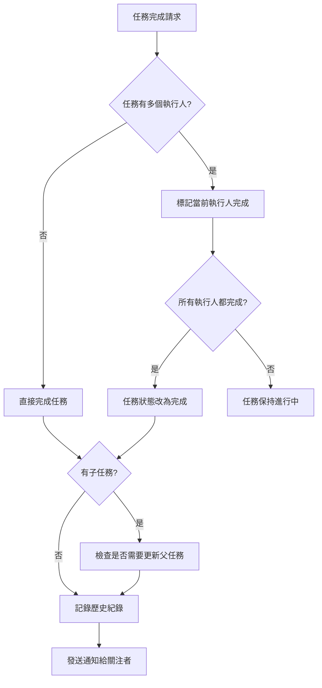

### 4.5 權限控制矩陣

| 操作 | 建立者 | 執行人 | 關注者 | 團隊管理員 | 團隊成員 |
|------|--------|--------|--------|------------|----------|
| 查看任務 | ✓ | ✓ | ✓ | ✓ | ✓ (同團隊) |
| 編輯任務 | ✓ | ✓ | ✗ | ✓ | ✗ |
| 刪除任務 | ✓ | ✗ | ✗ | ✓ | ✗ |
| 指派執行人 | ✓ | ✗ | ✗ | ✓ | ✗ |
| 新增關注者 | ✓ | ✓ | ✓ | ✓ | ✗ |
| 新增評論 | ✓ | ✓ | ✓ | ✓ | ✗ |
| 完成任務 | ✓ | ✓ | ✗ | ✓ | ✗ |

---

## 5. API 規格

### 5.1 API 概覽

| 模組 | 端點 | 方法 | 說明 |
|------|------|------|------|
| Auth | `/auth/register` | POST | 註冊 |
| Auth | `/auth/login` | POST | 登入 |
| Auth | `/auth/refresh` | POST | 刷新 Token |
| User | `/users/me` | GET | 取得當前使用者 |
| User | `/users/me` | PATCH | 更新個人資料 |
| Team | `/teams` | GET | 取得使用者的團隊 |
| Team | `/teams` | POST | 建立團隊 |
| Team | `/teams/:id` | GET | 取得團隊詳情 |
| Team | `/teams/:id` | PATCH | 更新團隊 |
| Team | `/teams/:id/members` | GET | 取得團隊成員 |
| Team | `/teams/:id/members` | POST | 新增成員 |
| Team | `/teams/:id/members/:userId` | DELETE | 移除成員 |
| Task | `/tasks` | GET | 取得任務列表 |
| Task | `/tasks` | POST | 建立任務 |
| Task | `/tasks/:id` | GET | 取得任務詳情 |
| Task | `/tasks/:id` | PATCH | 更新任務 |
| Task | `/tasks/:id` | DELETE | 刪除任務 |
| Task | `/tasks/:id/subtasks` | GET | 取得子任務 |
| Task | `/tasks/:id/subtasks` | POST | 建立子任務 |
| Task | `/tasks/:id/assignees` | POST | 新增執行人 |
| Task | `/tasks/:id/assignees/:userId` | DELETE | 移除執行人 |
| Task | `/tasks/:id/followers` | POST | 新增關注者 |
| Task | `/tasks/:id/followers/:userId` | DELETE | 移除關注者 |
| Task | `/tasks/:id/complete` | POST | 完成任務 |
| Comment | `/tasks/:taskId/comments` | GET | 取得評論 |
| Comment | `/tasks/:taskId/comments` | POST | 新增評論 |
| Comment | `/tasks/:taskId/comments/:id` | PATCH | 更新評論 |
| Comment | `/tasks/:taskId/comments/:id` | DELETE | 刪除評論 |
| History | `/tasks/:taskId/history` | GET | 取得任務歷史 |

### 5.2 認證 API

#### POST /auth/register

**Request Body:**
```json
{
  "email": "user@example.com",
  "password": "securePassword123",
  "name": "John Doe"
}
```

**Response (201):**
```json
{
  "success": true,
  "data": {
    "user": {
      "id": "uuid",
      "email": "user@example.com",
      "name": "John Doe",
      "avatarUrl": null,
      "createdAt": "2026-01-12T00:00:00.000Z"
    },
    "accessToken": "eyJhbGciOiJIUzI1NiIs..."
  }
}
```

#### POST /auth/login

**Request Body:**
```json
{
  "email": "user@example.com",
  "password": "securePassword123"
}
```

**Response (200):**
```json
{
  "success": true,
  "data": {
    "user": {
      "id": "uuid",
      "email": "user@example.com",
      "name": "John Doe"
    },
    "accessToken": "eyJhbGciOiJIUzI1NiIs..."
  }
}
```

### 5.3 任務 API

#### GET /tasks

**Query Parameters:**
| 參數 | 類型 | 說明 |
|------|------|------|
| teamId | UUID | 團隊 ID (必填) |
| status | string | 狀態篩選: pending, in_progress, completed |
| creatorId | UUID | 建立者篩選 |
| assigneeId | UUID | 執行人篩選 |
| startDate | ISO8601 | 截止日期起始 |
| endDate | ISO8601 | 截止日期結束 |
| sortBy | string | 排序欄位: createdAt, dueDate, id |
| sortOrder | string | 排序方向: ASC, DESC |
| page | number | 頁碼 (預設 1) |
| limit | number | 每頁數量 (預設 20) |
| view | string | 視圖: my_tasks, assigned, following, all |

**Response (200):**
```json
{
  "success": true,
  "data": {
    "items": [
      {
        "id": "uuid",
        "title": "Complete project documentation",
        "description": "Write technical specs",
        "status": "in_progress",
        "priority": "high",
        "dueDate": "2026-01-20T00:00:00.000Z",
        "creator": {
          "id": "uuid",
          "name": "John Doe",
          "avatarUrl": "..."
        },
        "assignees": [
          {
            "id": "uuid",
            "name": "Jane Smith",
            "isCompleted": false
          }
        ],
        "followersCount": 3,
        "subtasksCount": 2,
        "completedSubtasksCount": 1,
        "createdAt": "2026-01-10T00:00:00.000Z"
      }
    ],
    "meta": {
      "page": 1,
      "limit": 20,
      "total": 45,
      "totalPages": 3
    }
  }
}
```

#### POST /tasks

**Request Body:**
```json
{
  "title": "New Task",
  "description": "Task description",
  "teamId": "uuid",
  "parentTaskId": null,
  "priority": "medium",
  "dueDate": "2026-01-25T00:00:00.000Z",
  "assigneeIds": ["uuid1", "uuid2"],
  "followerIds": ["uuid3"]
}
```

**Response (201):**
```json
{
  "success": true,
  "data": {
    "id": "uuid",
    "title": "New Task",
    "description": "Task description",
    "status": "pending",
    "priority": "medium",
    "dueDate": "2026-01-25T00:00:00.000Z",
    "creator": { "id": "uuid", "name": "John Doe" },
    "assignees": [...],
    "followers": [...],
    "createdAt": "2026-01-12T00:00:00.000Z"
  }
}
```

#### PATCH /tasks/:id

**Request Body:**
```json
{
  "title": "Updated Title",
  "status": "in_progress",
  "priority": "high",
  "dueDate": "2026-01-30T00:00:00.000Z"
}
```

#### POST /tasks/:id/complete

**Request Body:**
```json
{
  "completeSubtasks": true
}
```

**Response (200):**
```json
{
  "success": true,
  "data": {
    "id": "uuid",
    "status": "completed",
    "completedAt": "2026-01-12T10:00:00.000Z"
  }
}
```

### 5.4 評論 API

#### POST /tasks/:taskId/comments

**Request Body:**
```json
{
  "content": "This is a comment"
}
```

### 5.5 歷史紀錄 API

#### GET /tasks/:taskId/history

**Response (200):**
```json
{
  "success": true,
  "data": [
    {
      "id": "uuid",
      "actionType": "status_changed",
      "oldValue": { "status": "pending" },
      "newValue": { "status": "in_progress" },
      "description": "John Doe changed status from pending to in_progress",
      "user": {
        "id": "uuid",
        "name": "John Doe",
        "avatarUrl": "..."
      },
      "createdAt": "2026-01-12T09:00:00.000Z"
    },
    {
      "id": "uuid",
      "actionType": "comment_added",
      "newValue": { "commentId": "uuid", "content": "Great progress!" },
      "description": "Jane Smith added a comment",
      "user": {
        "id": "uuid",
        "name": "Jane Smith"
      },
      "createdAt": "2026-01-12T10:00:00.000Z"
    }
  ]
}
```

---

## 6. 錯誤處理

### 6.1 錯誤回應格式

```json
{
  "success": false,
  "error": {
    "code": "TASK_NOT_FOUND",
    "message": "Task with id xxx not found",
    "details": {}
  }
}
```

### 6.2 錯誤碼列表

| HTTP Status | Error Code | 說明 |
|-------------|------------|------|
| 400 | VALIDATION_ERROR | 請求參數驗證失敗 |
| 401 | UNAUTHORIZED | 未認證 |
| 401 | INVALID_CREDENTIALS | 帳號密碼錯誤 |
| 401 | TOKEN_EXPIRED | Token 過期 |
| 403 | FORBIDDEN | 無權限執行此操作 |
| 404 | USER_NOT_FOUND | 使用者不存在 |
| 404 | TEAM_NOT_FOUND | 團隊不存在 |
| 404 | TASK_NOT_FOUND | 任務不存在 |
| 409 | EMAIL_ALREADY_EXISTS | Email 已被使用 |
| 409 | ALREADY_TEAM_MEMBER | 已是團隊成員 |
| 500 | INTERNAL_ERROR | 系統內部錯誤 |

---

## 7. 訊息提醒與定時任務規劃 (Schema 設計)

> 依需求：以下功能使用文字敘述規劃 schema 架構、流程

### 7.1 任務到期提醒

#### Schema 設計

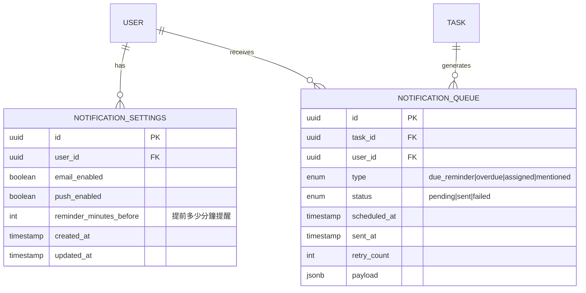

#### 流程設計

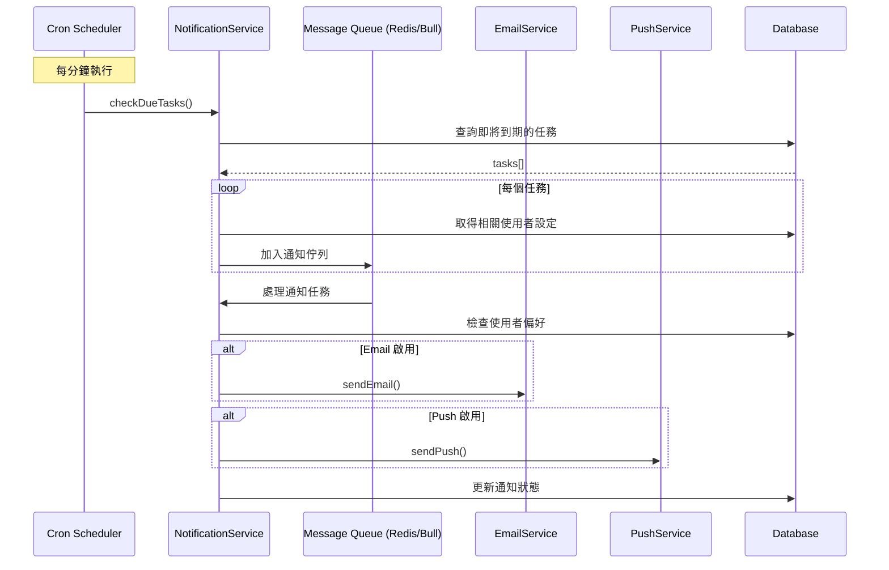

**使用的技術/服務**:
- **Bull Queue** (Redis-based): 用於排程和處理通知任務
- **@nestjs/schedule**: Cron job 管理
- **Nodemailer / SendGrid**: Email 發送服務
- **Firebase Cloud Messaging (FCM)**: Push 通知服務

### 7.2 定時重複任務

#### Schema 設計

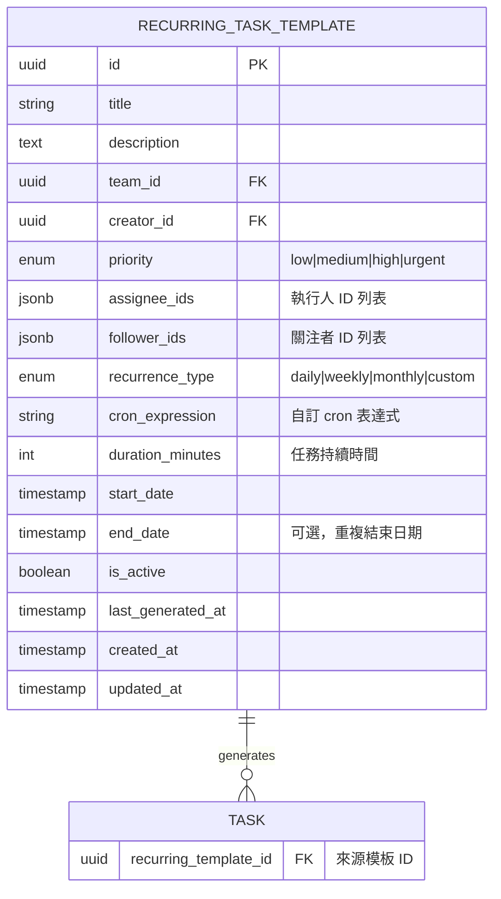

#### Recurrence Type 說明

| Type | Cron Expression 範例 | 說明 |
|------|---------------------|------|
| daily | `0 9 * * *` | 每天早上 9 點 |
| weekly | `0 9 * * 1` | 每週一早上 9 點 |
| monthly | `0 9 1 * *` | 每月 1 號早上 9 點 |
| custom | 自訂 | 使用者自訂 cron 表達式 |

#### 流程設計

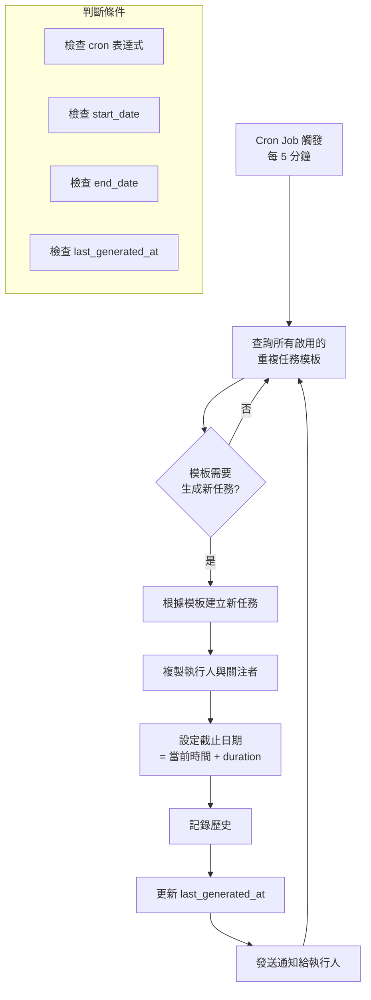

**使用的技術/服務**:
- **@nestjs/schedule + cron**: 定時任務排程
- **cron-parser**: 解析 cron 表達式
- **Bull Queue**: 任務生成佇列（避免重複生成）

---

## 8. Docker 部署配置

### 8.1 Dockerfile

```dockerfile
# Build stage
FROM node:20-alpine AS builder
WORKDIR /app
COPY package*.json ./
RUN npm ci
COPY . .
RUN npm run build

# Production stage
FROM node:20-alpine AS production
WORKDIR /app
COPY --from=builder /app/dist ./dist
COPY --from=builder /app/node_modules ./node_modules
COPY --from=builder /app/package*.json ./

EXPOSE 3000
CMD ["node", "dist/main.js"]
```

### 8.2 docker-compose.yml

```yaml
version: '3.8'

services:
  api:
    build:
      context: ./backend
      dockerfile: Dockerfile
    ports:
      - "3000:3000"
    environment:
      - NODE_ENV=production
      - DATABASE_URL=postgresql://postgres:password@db:5432/todolist
      - REDIS_URL=redis://redis:6379
      - JWT_SECRET=${JWT_SECRET}
    depends_on:
      - db
      - redis
    restart: unless-stopped

  db:
    image: postgres:15-alpine
    volumes:
      - postgres_data:/var/lib/postgresql/data
    environment:
      - POSTGRES_USER=postgres
      - POSTGRES_PASSWORD=password
      - POSTGRES_DB=todolist
    ports:
      - "5432:5432"
    restart: unless-stopped

  redis:
    image: redis:7-alpine
    volumes:
      - redis_data:/data
    ports:
      - "6379:6379"
    restart: unless-stopped

volumes:
  postgres_data:
  redis_data:
```

---

## 9. 安全性考量

1. **密碼加密**: 使用 bcrypt (rounds=12)
2. **JWT Token**:
   - Access Token 有效期: 15 分鐘
   - Refresh Token 有效期: 7 天
3. **Rate Limiting**: 使用 @nestjs/throttler
4. **Input Validation**: 使用 class-validator
5. **SQL Injection 防護**: TypeORM 參數化查詢
6. **XSS 防護**: 輸出轉義
7. **CORS 設定**: 限制來源網域

---

## Sources

- [Task Management Dashboard: Master Your Workflow | Lark](https://www.larksuite.com/en_us/blog/task-management-dashboard)
- [Get started with Tasks](https://www.larksuite.com/hc/en-US/articles/852016433850-get-started-with-tasks)
- [Add task and sub-task owners](https://www.larksuite.com/hc/en-US/articles/360048488501-add-task-and-sub-task-owners)
- [View task list activities and configure push notification rules](https://www.larksuite.com/hc/en-US/articles/974260395786-view-task-list-activities-and-configure-push-notification-rules)
- [Tasks updates](https://www.larksuite.com/hc/en-US/articles/360048488301-tasks-updates)
