# TodoList Frontend Specification

> 前端技術棧：Next.js 14 (App Router) + TypeScript + Tailwind CSS + React Query

## 1. 系統架構概覽

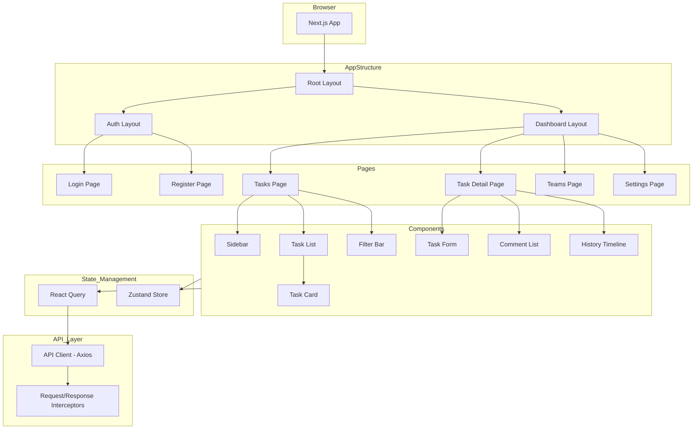

---

## 2. 專案目錄結構

```
src/
├── app/
│   ├── layout.tsx                    # Root layout
│   ├── page.tsx                      # Landing/redirect
│   ├── (auth)/
│   │   ├── layout.tsx                # Auth layout (無側邊欄)
│   │   ├── login/
│   │   │   └── page.tsx
│   │   └── register/
│   │       └── page.tsx
│   └── (dashboard)/
│       ├── layout.tsx                # Dashboard layout (有側邊欄)
│       ├── tasks/
│       │   ├── page.tsx              # 任務列表
│       │   └── [id]/
│       │       └── page.tsx          # 任務詳情
│       ├── teams/
│       │   ├── page.tsx              # 團隊列表
│       │   └── [id]/
│       │       ├── page.tsx          # 團隊詳情
│       │       └── members/
│       │           └── page.tsx
│       └── settings/
│           └── page.tsx
├── components/
│   ├── ui/                           # 基礎 UI 元件
│   │   ├── button.tsx
│   │   ├── input.tsx
│   │   ├── select.tsx
│   │   ├── modal.tsx
│   │   ├── dropdown.tsx
│   │   ├── avatar.tsx
│   │   ├── badge.tsx
│   │   ├── toast.tsx
│   │   └── loading.tsx
│   ├── layout/
│   │   ├── sidebar.tsx
│   │   ├── header.tsx
│   │   └── navigation.tsx
│   ├── auth/
│   │   ├── login-form.tsx
│   │   └── register-form.tsx
│   ├── task/
│   │   ├── task-list.tsx
│   │   ├── task-card.tsx
│   │   ├── task-form.tsx
│   │   ├── task-detail.tsx
│   │   ├── task-filter.tsx
│   │   ├── task-sort.tsx
│   │   ├── subtask-list.tsx
│   │   ├── assignee-select.tsx
│   │   └── follower-select.tsx
│   ├── comment/
│   │   ├── comment-list.tsx
│   │   └── comment-form.tsx
│   ├── history/
│   │   └── history-timeline.tsx
│   └── team/
│       ├── team-card.tsx
│       ├── team-form.tsx
│       └── member-list.tsx
├── hooks/
│   ├── use-auth.ts
│   ├── use-tasks.ts
│   ├── use-teams.ts
│   ├── use-comments.ts
│   └── use-debounce.ts
├── lib/
│   ├── api/
│   │   ├── client.ts                 # Axios instance
│   │   ├── auth.ts
│   │   ├── tasks.ts
│   │   ├── teams.ts
│   │   └── comments.ts
│   ├── utils/
│   │   ├── date.ts
│   │   ├── format.ts
│   │   └── validation.ts
│   └── constants.ts
├── stores/
│   ├── auth-store.ts
│   └── ui-store.ts
├── types/
│   ├── api.ts
│   ├── auth.ts
│   ├── task.ts
│   ├── team.ts
│   └── user.ts
├── styles/
│   └── globals.css
└── middleware.ts                      # Route protection
```

---

## 3. 頁面設計與路由

### 3.1 路由結構

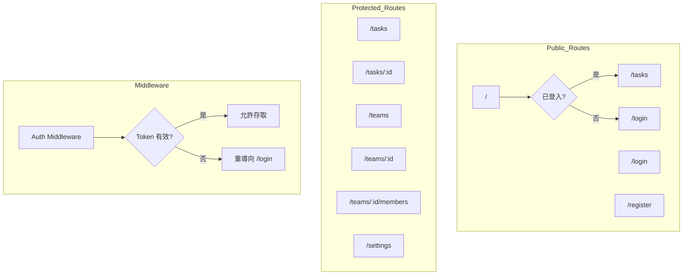

### 3.2 頁面與功能對應

| 路由 | 頁面 | 功能 |
|------|------|------|
| `/login` | 登入頁 | 使用者登入表單 |
| `/register` | 註冊頁 | 使用者註冊表單 |
| `/tasks` | 任務列表 | 顯示所有任務、篩選、排序、新增任務 |
| `/tasks/:id` | 任務詳情 | 任務編輯、子任務、評論、歷史紀錄 |
| `/teams` | 團隊列表 | 顯示使用者的團隊、建立團隊 |
| `/teams/:id` | 團隊詳情 | 團隊資訊、團隊任務 |
| `/teams/:id/members` | 成員管理 | 新增/移除成員、角色管理 |
| `/settings` | 設定頁 | 個人資料、通知設定 |

---

## 4. 元件設計

### 4.1 任務列表頁面架構

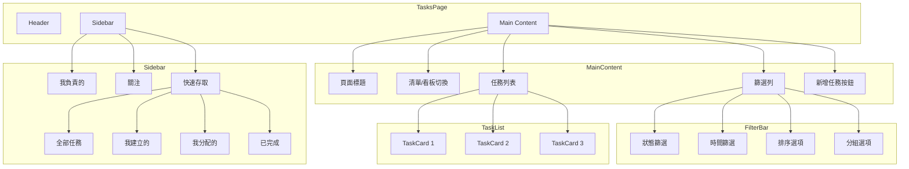

### 4.2 任務卡片元件

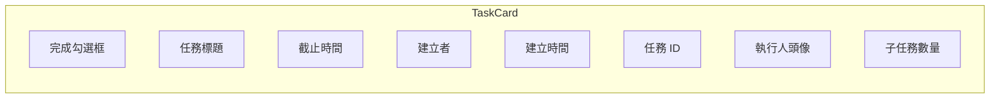

### 4.3 任務詳情頁面架構

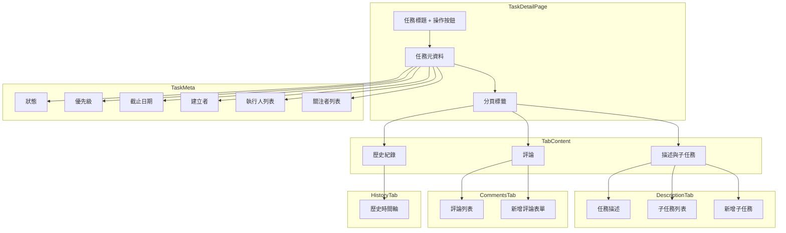

---

## 5. 狀態管理

### 5.1 架構設計

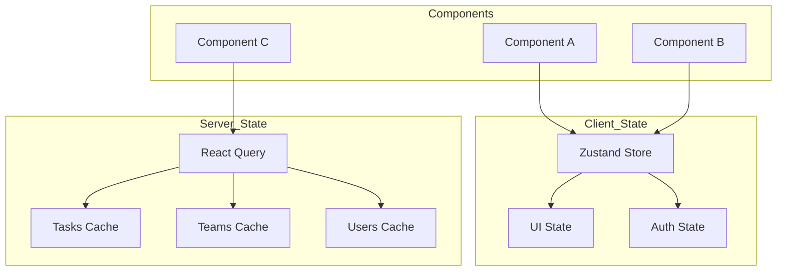

### 5.2 Zustand Store 設計

#### Auth Store

```typescript
// stores/auth-store.ts
interface AuthState {
  user: User | null;
  token: string | null;
  isAuthenticated: boolean;
  isLoading: boolean;

  // Actions
  setUser: (user: User) => void;
  setToken: (token: string) => void;
  login: (email: string, password: string) => Promise<void>;
  logout: () => void;
  register: (data: RegisterData) => Promise<void>;
}
```

#### UI Store

```typescript
// stores/ui-store.ts
interface UIState {
  sidebarCollapsed: boolean;
  currentTeamId: string | null;
  currentView: 'my_tasks' | 'assigned' | 'following' | 'all' | 'completed';
  taskViewMode: 'list' | 'board';

  // Filter state
  filters: {
    status: TaskStatus | null;
    startDate: Date | null;
    endDate: Date | null;
    creatorId: string | null;
    assigneeId: string | null;
  };
  sortBy: 'createdAt' | 'dueDate' | 'id';
  sortOrder: 'ASC' | 'DESC';

  // Actions
  toggleSidebar: () => void;
  setCurrentTeam: (teamId: string) => void;
  setCurrentView: (view: string) => void;
  setFilters: (filters: Partial<FilterState>) => void;
  setSorting: (sortBy: string, order: string) => void;
  resetFilters: () => void;
}
```

### 5.3 React Query Hooks

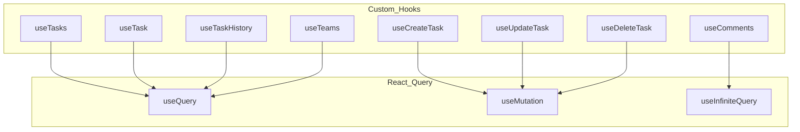

#### 範例 Hook 實作

```typescript
// hooks/use-tasks.ts
export function useTasks(params: TaskQueryParams) {
  const { currentTeamId, currentView, filters, sortBy, sortOrder } = useUIStore();

  return useQuery({
    queryKey: ['tasks', currentTeamId, currentView, filters, sortBy, sortOrder],
    queryFn: () => tasksApi.getTasks({
      teamId: currentTeamId,
      view: currentView,
      ...filters,
      sortBy,
      sortOrder,
    }),
    enabled: !!currentTeamId,
  });
}

export function useCreateTask() {
  const queryClient = useQueryClient();

  return useMutation({
    mutationFn: tasksApi.createTask,
    onSuccess: () => {
      queryClient.invalidateQueries({ queryKey: ['tasks'] });
    },
  });
}
```

---

## 6. UI/UX 設計

### 6.1 配色方案 (參考 Lark)

| 用途 | 色碼 | 說明 |
|------|------|------|
| Primary | `#3370FF` | 主要按鈕、連結 |
| Primary Hover | `#2860E5` | Hover 狀態 |
| Success | `#34C759` | 成功/完成狀態 |
| Warning | `#FF9500` | 警告/即將到期 |
| Danger | `#FF3B30` | 錯誤/刪除 |
| Background | `#F5F6F7` | 頁面背景 |
| Sidebar BG | `#FFFFFF` | 側邊欄背景 |
| Card BG | `#FFFFFF` | 卡片背景 |
| Text Primary | `#1F2329` | 主要文字 |
| Text Secondary | `#646A73` | 次要文字 |
| Border | `#E5E6E8` | 邊框 |

### 6.2 任務狀態顏色

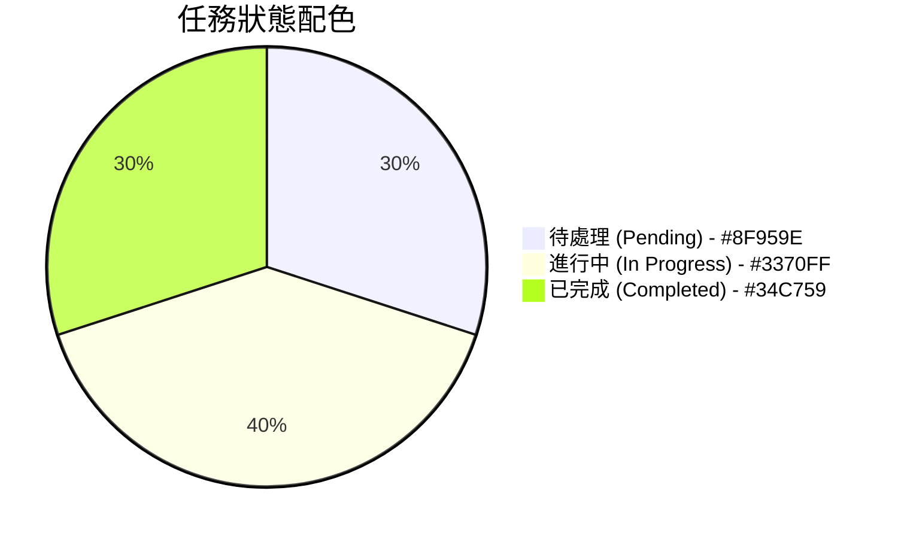

| 狀態 | 顏色 | Badge 樣式 |
|------|------|-----------|
| 待處理 | `#8F959E` | 灰色背景 |
| 進行中 | `#3370FF` | 藍色背景 |
| 已完成 | `#34C759` | 綠色背景 |

### 6.3 優先級標示

| 優先級 | 顏色 | 圖示 |
|--------|------|------|
| Low | `#8F959E` | 向下箭頭 |
| Medium | `#3370FF` | 橫線 |
| High | `#FF9500` | 向上箭頭 |
| Urgent | `#FF3B30` | 雙向上箭頭 |

### 6.4 響應式斷點

| 斷點 | 寬度 | 說明 |
|------|------|------|
| sm | 640px | 手機 |
| md | 768px | 平板 |
| lg | 1024px | 小型桌面 |
| xl | 1280px | 桌面 |
| 2xl | 1536px | 大型桌面 |

---

## 7. 使用者流程

### 7.1 登入流程

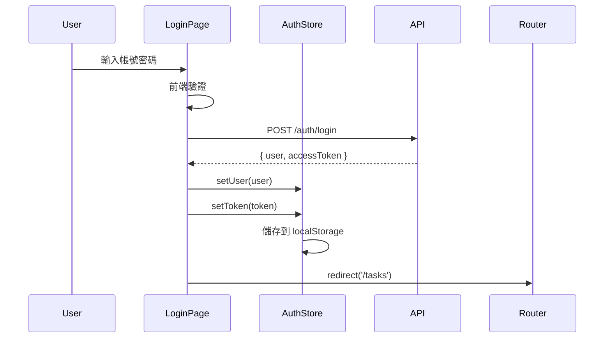

### 7.2 任務建立流程

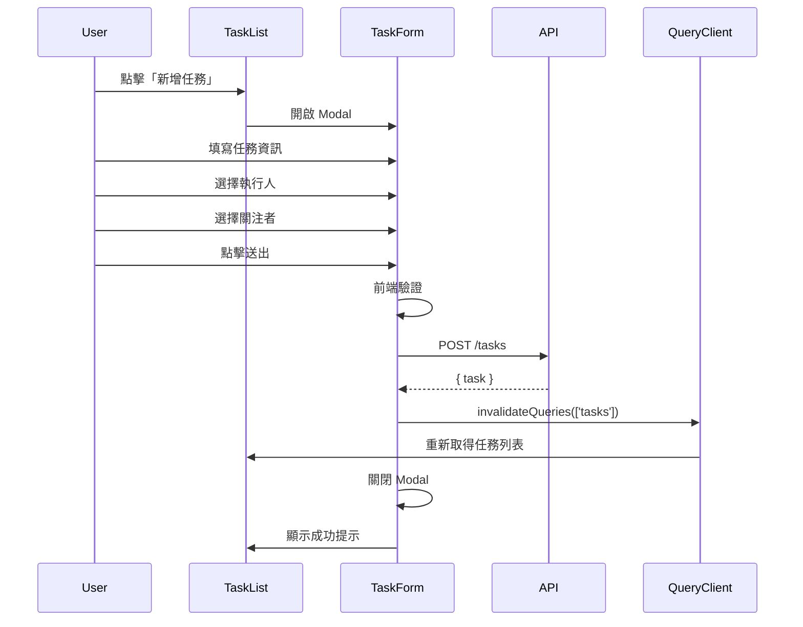

### 7.3 子任務完成流程

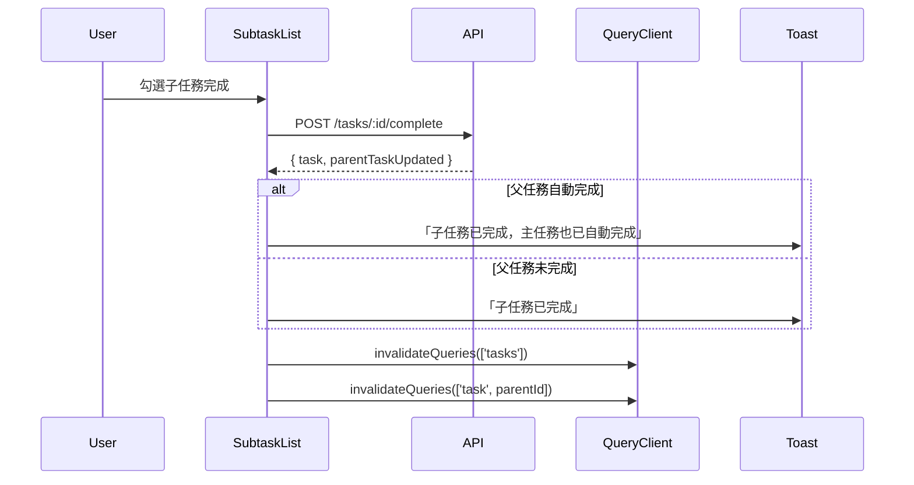

### 7.4 篩選與排序流程

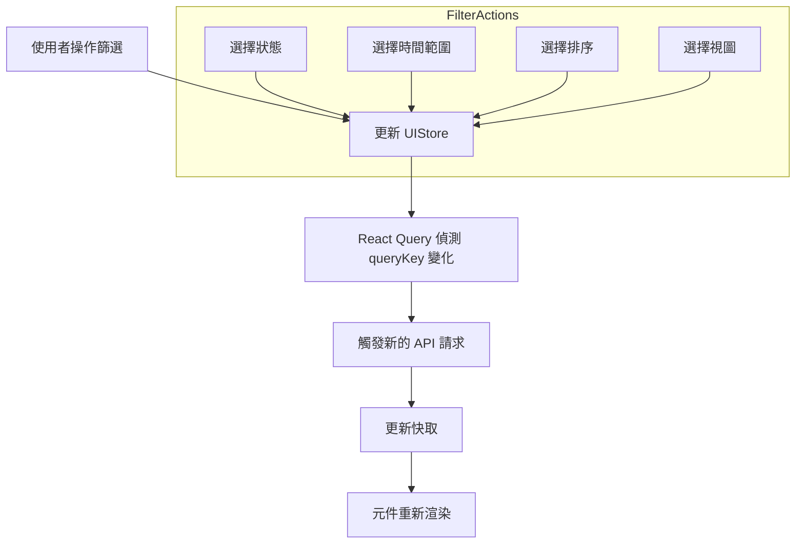

---

## 8. API 整合層

### 8.1 Axios Client 設計

```typescript
// lib/api/client.ts
import axios from 'axios';
import { useAuthStore } from '@/stores/auth-store';

const apiClient = axios.create({
  baseURL: process.env.NEXT_PUBLIC_API_URL,
  timeout: 10000,
  headers: {
    'Content-Type': 'application/json',
  },
});

// Request interceptor - 加入 Token
apiClient.interceptors.request.use((config) => {
  const token = useAuthStore.getState().token;
  if (token) {
    config.headers.Authorization = `Bearer ${token}`;
  }
  return config;
});

// Response interceptor - 處理錯誤
apiClient.interceptors.response.use(
  (response) => response.data,
  async (error) => {
    if (error.response?.status === 401) {
      useAuthStore.getState().logout();
      window.location.href = '/login';
    }
    return Promise.reject(error);
  }
);

export default apiClient;
```

### 8.2 API 函數設計

```typescript
// lib/api/tasks.ts
import apiClient from './client';
import { Task, CreateTaskDto, UpdateTaskDto, TaskQueryParams } from '@/types/task';
import { PaginatedResponse } from '@/types/api';

export const tasksApi = {
  getTasks: (params: TaskQueryParams): Promise<PaginatedResponse<Task>> =>
    apiClient.get('/tasks', { params }),

  getTask: (id: string): Promise<Task> =>
    apiClient.get(`/tasks/${id}`),

  createTask: (data: CreateTaskDto): Promise<Task> =>
    apiClient.post('/tasks', data),

  updateTask: (id: string, data: UpdateTaskDto): Promise<Task> =>
    apiClient.patch(`/tasks/${id}`, data),

  deleteTask: (id: string): Promise<void> =>
    apiClient.delete(`/tasks/${id}`),

  completeTask: (id: string, completeSubtasks?: boolean): Promise<Task> =>
    apiClient.post(`/tasks/${id}/complete`, { completeSubtasks }),

  getSubtasks: (taskId: string): Promise<Task[]> =>
    apiClient.get(`/tasks/${taskId}/subtasks`),

  addAssignee: (taskId: string, userId: string): Promise<void> =>
    apiClient.post(`/tasks/${taskId}/assignees`, { userId }),

  removeAssignee: (taskId: string, userId: string): Promise<void> =>
    apiClient.delete(`/tasks/${taskId}/assignees/${userId}`),

  addFollower: (taskId: string, userId: string): Promise<void> =>
    apiClient.post(`/tasks/${taskId}/followers`, { userId }),

  removeFollower: (taskId: string, userId: string): Promise<void> =>
    apiClient.delete(`/tasks/${taskId}/followers/${userId}`),

  getHistory: (taskId: string): Promise<TaskHistory[]> =>
    apiClient.get(`/tasks/${taskId}/history`),
};
```

---

## 9. TypeScript 類型定義

### 9.1 共用類型

```typescript
// types/api.ts
export interface ApiResponse<T> {
  success: boolean;
  data: T;
}

export interface ApiError {
  success: false;
  error: {
    code: string;
    message: string;
    details?: Record<string, any>;
  };
}

export interface PaginatedResponse<T> {
  items: T[];
  meta: {
    page: number;
    limit: number;
    total: number;
    totalPages: number;
  };
}
```

### 9.2 Task 類型

```typescript
// types/task.ts
export type TaskStatus = 'pending' | 'in_progress' | 'completed';
export type TaskPriority = 'low' | 'medium' | 'high' | 'urgent';
export type TaskView = 'my_tasks' | 'assigned' | 'following' | 'all' | 'completed';

export interface Task {
  id: string;
  title: string;
  description: string | null;
  status: TaskStatus;
  priority: TaskPriority;
  dueDate: string | null;
  completedAt: string | null;
  createdAt: string;
  updatedAt: string;
  creator: UserSummary;
  team: TeamSummary;
  parentTask: TaskSummary | null;
  assignees: TaskAssignee[];
  followers: UserSummary[];
  subtasksCount: number;
  completedSubtasksCount: number;
}

export interface TaskAssignee {
  id: string;
  name: string;
  avatarUrl: string | null;
  isCompleted: boolean;
}

export interface CreateTaskDto {
  title: string;
  description?: string;
  teamId: string;
  parentTaskId?: string;
  priority?: TaskPriority;
  dueDate?: string;
  assigneeIds?: string[];
  followerIds?: string[];
}

export interface UpdateTaskDto {
  title?: string;
  description?: string;
  status?: TaskStatus;
  priority?: TaskPriority;
  dueDate?: string | null;
}

export interface TaskQueryParams {
  teamId: string;
  view?: TaskView;
  status?: TaskStatus;
  creatorId?: string;
  assigneeId?: string;
  startDate?: string;
  endDate?: string;
  sortBy?: 'createdAt' | 'dueDate' | 'id';
  sortOrder?: 'ASC' | 'DESC';
  page?: number;
  limit?: number;
}
```

### 9.3 History 類型

```typescript
// types/history.ts
export type HistoryActionType =
  | 'created'
  | 'updated'
  | 'status_changed'
  | 'assignee_added'
  | 'assignee_removed'
  | 'follower_added'
  | 'follower_removed'
  | 'comment_added'
  | 'completed';

export interface TaskHistory {
  id: string;
  actionType: HistoryActionType;
  oldValue: Record<string, any> | null;
  newValue: Record<string, any> | null;
  description: string;
  user: UserSummary;
  createdAt: string;
}
```

---

## 10. 元件詳細規格

### 10.1 Sidebar 元件

**Props:**
```typescript
interface SidebarProps {
  teams: Team[];
  currentTeamId: string | null;
  currentView: TaskView;
  onTeamChange: (teamId: string) => void;
  onViewChange: (view: TaskView) => void;
}
```

**功能需求:**
- 顯示團隊切換下拉選單
- 顯示任務視圖選項 (我負責的、關注、全部任務、我建立的、我分配的、已完成)
- 高亮當前選中項目
- 支援收合/展開
- 顯示每個視圖的任務數量 badge

### 10.2 TaskCard 元件

**Props:**
```typescript
interface TaskCardProps {
  task: Task;
  onClick: () => void;
  onComplete: (taskId: string) => void;
}
```

**功能需求:**
- 顯示任務標題、截止時間、建立者、建立時間、任務 ID
- 顯示執行人頭像列表
- 顯示子任務進度 (e.g., "2/5")
- 完成勾選框
- 優先級標示
- 過期任務紅色標示

### 10.3 TaskFilter 元件

**Props:**
```typescript
interface TaskFilterProps {
  onFilterChange: (filters: TaskFilters) => void;
  teamMembers: User[];
}
```

**篩選選項:**
- 狀態：全部 / 待處理 / 進行中 / 已完成
- 時段：今天 / 本週 / 本月 / 自訂範圍
- 建立者：團隊成員下拉選單
- 執行人：團隊成員下拉選單

### 10.4 TaskSort 元件

**排序選項:**
- 建立時間 (預設)
- 計劃完成時間 (截止日期)
- 創建者
- 任務 ID

---

## 11. 錯誤處理

### 11.1 全域錯誤處理

```typescript
// components/providers/error-boundary.tsx
export function ErrorBoundary({ children }: { children: React.ReactNode }) {
  return (
    <QueryErrorResetBoundary>
      {({ reset }) => (
        <ReactErrorBoundary
          onReset={reset}
          fallbackRender={({ error, resetErrorBoundary }) => (
            <ErrorFallback
              error={error}
              onRetry={resetErrorBoundary}
            />
          )}
        >
          {children}
        </ReactErrorBoundary>
      )}
    </QueryErrorResetBoundary>
  );
}
```

### 11.2 Toast 通知

| 類型 | 用途 |
|------|------|
| Success | 操作成功 (建立任務、更新成功) |
| Error | API 錯誤、驗證錯誤 |
| Warning | 警告提示 (任務即將到期) |
| Info | 一般資訊提示 |

---

## 12. 效能優化

### 12.1 優化策略

| 策略 | 實作方式 |
|------|----------|
| **Code Splitting** | Next.js dynamic imports |
| **Image Optimization** | next/image 元件 |
| **Query Caching** | React Query staleTime/cacheTime |
| **Memoization** | React.memo, useMemo, useCallback |
| **Virtual Scrolling** | react-virtual (長列表) |
| **Debouncing** | 搜尋/篩選輸入 debounce |

### 12.2 React Query 快取策略

```typescript
// 全域設定
const queryClient = new QueryClient({
  defaultOptions: {
    queries: {
      staleTime: 5 * 60 * 1000, // 5 分鐘內不重新取得
      cacheTime: 30 * 60 * 1000, // 快取 30 分鐘
      refetchOnWindowFocus: false,
      retry: 1,
    },
  },
});
```

---

## 13. 部署配置

### 13.1 Dockerfile

```dockerfile
FROM node:20-alpine AS deps
WORKDIR /app
COPY package*.json ./
RUN npm ci

FROM node:20-alpine AS builder
WORKDIR /app
COPY --from=deps /app/node_modules ./node_modules
COPY . .
ENV NEXT_TELEMETRY_DISABLED 1
RUN npm run build

FROM node:20-alpine AS runner
WORKDIR /app
ENV NODE_ENV production
ENV NEXT_TELEMETRY_DISABLED 1

RUN addgroup --system --gid 1001 nodejs
RUN adduser --system --uid 1001 nextjs

COPY --from=builder /app/public ./public
COPY --from=builder /app/.next/standalone ./
COPY --from=builder /app/.next/static ./.next/static

USER nextjs
EXPOSE 3000
ENV PORT 3000

CMD ["node", "server.js"]
```

### 13.2 環境變數

```env
# .env.example
NEXT_PUBLIC_API_URL=http://localhost:3001
NEXT_PUBLIC_APP_NAME=TodoList
```

---

## 14. 測試策略

| 測試類型 | 工具 | 範圍 |
|----------|------|------|
| Unit Test | Vitest | Hooks, Utils |
| Component Test | React Testing Library | UI 元件 |
| Integration Test | Cypress | 使用者流程 |
| E2E Test | Playwright | 完整功能 |

---

## Sources

- [Task Management Dashboard: Master Your Workflow | Lark](https://www.larksuite.com/en_us/blog/task-management-dashboard)
- [Get started with Tasks](https://www.larksuite.com/hc/en-US/articles/852016433850-get-started-with-tasks)
- [Add task and sub-task owners](https://www.larksuite.com/hc/en-US/articles/360048488501-add-task-and-sub-task-owners)
